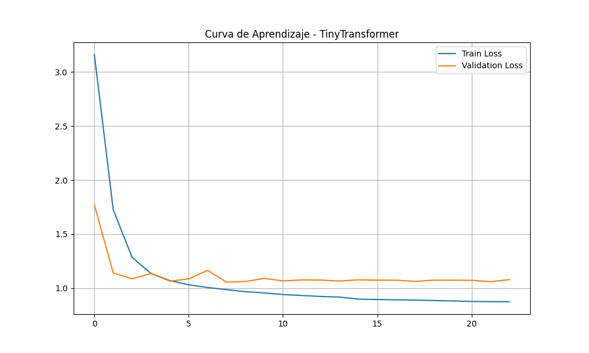
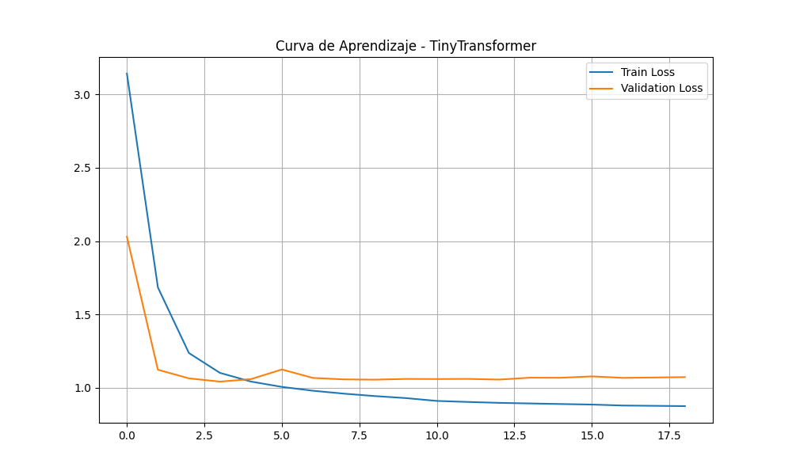
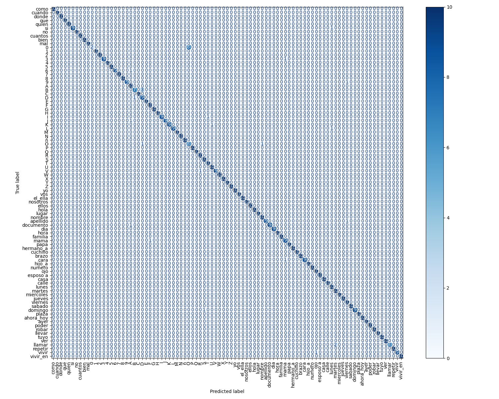
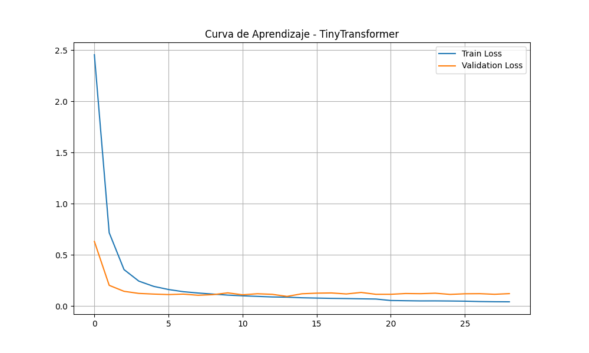
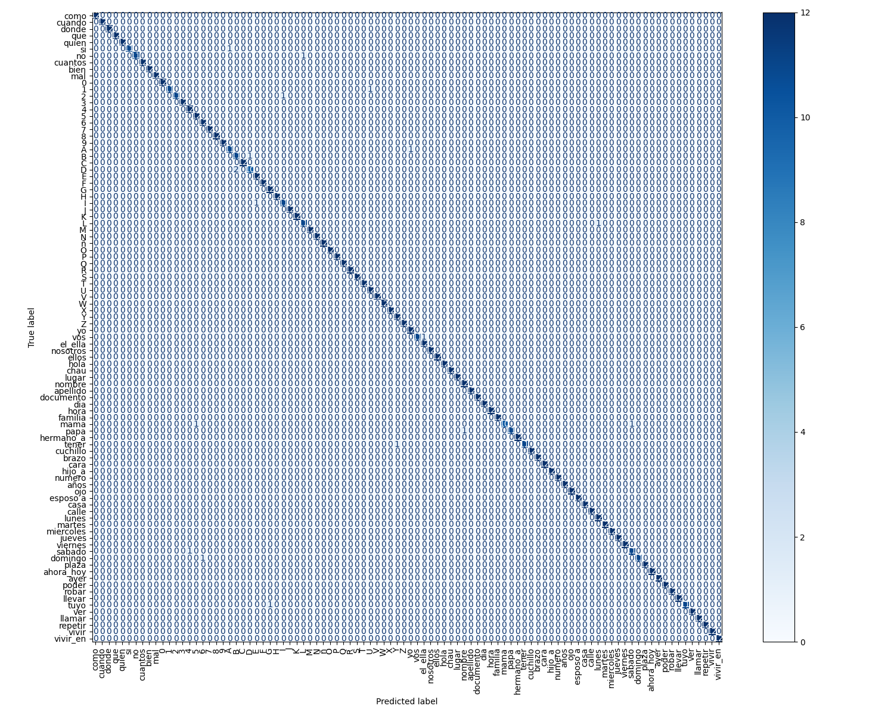

# Entregable semana — Clasificador LSA

> **Trabajo Final:** Proyecto y/o Diseño de Ingeniería en Informática (Tipo 1)  
> **Autores:** Maite Nigro, Francisco Veron  
> **Directores:** Esp. Ing. Gonzalo Avalos Ribas, Ing. Bruno Constanzo  
> **Repositorio:** [2026_Proyecto_LSA](https://github.com/FranciscoVeronING/2026_Proyecto_LSA) — rama `scratch-mediapipe`  
> **Fecha entrega:** _[completar viernes]_  
> **Estado:** borrador en revisión — modificar libremente antes de exportar a PDF

---

## 1. Resumen ejecutivo

Este documento describe el **clasificador de glosas LSA** del prototipo de traducción bidireccional desarrollado como Trabajo Final de Grado en la UNMDP. En términos simples: el sistema mira la webcam, detecta la forma del cuerpo y las manos de una persona, y **adivina qué seña está haciendo** dentro de un vocabulario acotado de 91 palabras en LSA.

Todo el procesamiento ocurre **en la máquina local** (*edge computing*): no se envían videos a la nube. Eso responde a un requisito de privacidad del proyecto (conversaciones policiales o de asistencia al viajero no deben salir del dispositivo).

**Qué se entrega esta semana:**

- Un pipeline completo: video o webcam → landmarks → secuencia numérica → predicción de seña.
- Un modelo entrenado sobre **91 clases** (cada una con al menos 50 videos de entrenamiento).
- Mejoras para que entrenamiento e inferencia en vivo usen **exactamente el mismo tratamiento** de datos.
- Herramientas de evaluación (`camera.py --eval`) para medir cuán bien funciona en la práctica.
- Esta documentación explicativa.

**Qué se espera obtener:**

| Expectativa | Cómo se mide |
|-------------|--------------|
| Clasificador usable en webcam | Demo en vivo con `camera.py` |
| ~90% ±10% de acierto general | Prueba formal de 91 señas (top-1 y top-3) |
| Base sólida para integrar con el módulo semántico | Salida estable de glosas reconocidas |

**Métricas consolidadas (cuatro iteraciones + Optuna):**

| Iter. | Frames | Arquitectura | Val acc | Val loss | Eval top-1 | Eval top-3 | Fuera top-3 |
|-------|--------|--------------|---------|----------|------------|------------|-------------|
| **A** | 16 | 128 / 4h / 2L | 97,36% | 1,05 | 61,5% | 83,5% | 15 |
| **B** | 32 | 128 / 4h / 2L | 96,48% | 1,04 | **71,4%** | 87,9% | 11 |
| **C** | 32 | 64 / 2h / 1L | 97,36% | 1,10 | 67,0% | **90,1%** | **9** |
| **D** | 32 | 128 / **8h** / 2L (Optuna) | **97,69%** | **0,087** | 66,0% | 84,6% | 14 |

**Conclusión:** **32 frames** supera a 16 en vivo. **B** sigue siendo la mejor en **top-1** (71,4%). **C** cumple el objetivo en **top-3** (~90%). **Optuna (D)** mejoró fuerte las métricas offline (val loss 0,087) pero **no superó B ni C en cámara** (66,0% top-1, 84,6% top-3; eval oficial `204753`). Para el MVP conviene **B** (demo top-1) o **C** (desambiguación top-3), no D.

---

## 2. Glosario — conceptos que aparecen en este documento

Antes de entrar en detalle técnico, conviene fijar el significado de los términos que usamos a lo largo del informe.

| Concepto | Qué es | Ejemplo en este proyecto |
|----------|--------|--------------------------|
| **LSA** | Lengua de Señas Argentina. Tiene gramática propia, distinta del español oral. | Una persona hace el gesto de *hola* con una mano en la frente. |
| **Glosa** | Unidad mínima de significado en la lengua de señas (equivalente aproximado de una “palabra”). | La glosa `hola`, `nombre`, `robar`. |
| **Landmark** | Punto clave del cuerpo detectado por MediaPipe (hombro, muñeca, punta de dedo, etc.). | 33 puntos de pose + 21 por mano × 2 = 75 puntos por frame. |
| **MediaPipe Holistic** | Librería de Google que estima pose y manos en tiempo real desde video. | Convierte un frame de webcam en coordenadas numéricas. |
| **Secuencia temporal** | Serie ordenada de frames que representa un gesto completo. | 16 “fotos” del esqueleto durante la seña *martes*. |
| **Normalización espacial** | Ajustar coordenadas para que el cuerpo quede centrado y a escala fija. | Dos personas a distinta distancia de la cámara producen vectores comparables. |
| **Subsampleo** | Reducir una secuencia larga a N frames equiespaciados. | 60 frames capturados → se eligen 16 repartidos uniformemente. |
| **Trim (recorte)** | Eliminar frames de silencio al inicio/fin del gesto. | Sacar los frames donde la persona aún no empezó o ya bajó las manos. |
| **Clasificador** | Red neuronal que asigna una etiqueta (nombre de seña) a una secuencia. | Entrada: tensor `(16, 225)` → salida: probabilidad sobre 91 clases. |
| **Top-1 / Top-3** | Métricas de acierto. Top-1: ¿acertó la predicción #1? Top-3: ¿está la correcta entre las 3 mejores? | Esperada `mal`, predicho `bien` → top-1 falla, top-3 puede acertar si `mal` está en el podio. |
| **Confianza** | Probabilidad (0–1) que el modelo asigna a su predicción principal. | 0.92 = “muy seguro”; 0.45 = “dudoso”. |
| **Transfer learning** | Reutilizar un modelo ya entrenado en otro dataset y adaptarlo al nuestro. | Línea paralela de Maite (ver sección 6.6). |
| **Edge computing** | Procesar en el dispositivo del usuario, sin servidores remotos. | `camera.py` corre en la notebook del operador. |

---

## 3. Contexto del proyecto

### 3.1 Problemática

En una videollamada entre una persona sorda y una oyente, hoy la comunicación casi siempre pasa por **texto escrito**. Eso tiene dos problemas:

1. **Asimetría:** la persona sorda se expresa en LSA (lengua visual-gestual), pero recibe español escrito (segunda lengua para muchos).
2. **Pérdida de expresividad:** subtítulos o chat no capturan matices ni ritmo de una conversación en señas.

Este Trabajo Final busca un **puente automático** LSA ↔ español. El sistema se divide en módulos independientes para poder avanzar por partes:

```
┌─────────────────────────────────────────────────────────────────┐
│                    PROTOTIPO COMPLETO (visión)                   │
├──────────────┬──────────────────────┬───────────────────────────┤
│  Extracción  │   Clasificador       │   Módulo semántico        │
│  (MediaPipe) │   (ESTE ENTREGABLE)  │   (entregado sem. pasada) │
│              │                      │                           │
│  Video →     │  Secuencia →         │  Glosas → oración         │
│  landmarks   │  nombre de glosa     │  en español               │
└──────────────┴──────────────────────┴───────────────────────────┘
```

**Este entregable cubre solo el clasificador.** El módulo semántico (rama `modulo-semantico`) ya fue entregado la semana pasada: recibe glosas como `["yo", "llamar", "policia"]` y produce algo como *"Yo llamo a la policía"*. Todavía no está cableado en tiempo real con este clasificador; eso es un paso posterior.

### 3.2 Alcance del vocabulario

No se intenta reconocer **cualquier** conversación en LSA. El vocabulario fue definido con la experta Miriam Rolls y está orientado a:

- Contextos de **seguridad** (identificación, verbos de emergencia).
- Contextos de **asistencia al viajero** (lugares, días, familia).

De ~100 señas planificadas, **91 cumplen el mínimo de 50 videos** por clase y entran al modelo. Las que no alcanzan ese umbral se excluyen automáticamente para no entrenar clases con datos insuficientes.

**Ejemplo:** si la seña `departamento` solo tiene 30 videos grabados, el entrenamiento la ignora. Es preferible **menos clases pero estables** que muchas clases con pocas muestras que el modelo confunda al azar.

### 3.3 Organización del repositorio

| Elemento | Detalle | Rol |
|----------|---------|-----|
| Repo activo | `FranciscoVeronING/2026_Proyecto_LSA` | Código central del TF |
| Clasificador from scratch (Francisco) | rama `scratch-mediapipe` | **Este entregable** |
| Clasificador transfer learning (Maite) | rama propia en el mismo repo | Línea alternativa; se comparará después |
| Módulo semántico | rama `modulo-semantico` | Entregado semana pasada |
| Repo descartado | `2026---Trabajo-Final-Informatica` | Reemplazado por orden de la cátedra |

---

## 4. Decisiones de diseño — qué se eligió, por qué y qué se espera

Esta sección explica las **decisiones de ingeniería** más importantes. Cada una responde a una pregunta concreta del diseño.

### 4.1 ¿Trabajar con píxeles o con landmarks?

**Opciones evaluadas:**
- **CNN sobre video RGB:** la red ve la imagen cruda, frame por frame.
- **Landmarks (esqueleto):** primero se extraen puntos del cuerpo; la red ve solo coordenadas numéricas.

**Decisión:** landmarks con MediaPipe Holistic.

**Por qué:**
- Un video de 30 FPS en 1080p tiene millones de píxeles por frame; un frame de landmarks tiene **225 números**. Menos datos = entrenamiento más viable con nuestro dataset acotado.
- El fondo, la ropa o la iluminación afectan menos: lo que importa es la **forma del gesto**, no el color de la remera.
- Es el enfoque estándar en la literatura de *skeleton-based sign language recognition*.

**Qué se espera obtener:** un modelo liviano (~4 MB de pesos) que corra en tiempo cuasi real en una PC común.

**Trade-off aceptado:** si MediaPipe pierde las manos (manos fuera de cuadro, oclusión), la señal se degrada. Por eso se agregó interpolación de frames con ceros (sección 5.2).

**Ejemplo:** dos personas con distinta ropa frente a la misma pared blanca producen landmarks similares si hacen la misma seña; una CNN sobre píxeles podría aprender patrones de ropa irrelevantes.

---

### 4.2 ¿LSTM o Transformer?

**Opciones evaluadas:**
- **LSTM:** redes recurrentes clásicas para secuencias.
- **Transformer:** mecanismo de atención entre frames.

**Decisión:** Tiny Transformer (128 dimensiones, 2 capas, 4 cabezas de atención) con una capa Conv1D previa.

**Por qué:**
- El Transformer puede relacionar **cualquier frame con cualquier otro** en un solo paso (atención global). En señas compuestas, el movimiento inicial y la pose final pueden ser igualmente importantes.
- Con pocas capas se mantiene el modelo chico para nuestro volumen de datos.
- La Conv1D previa extrae patrones locales en el tiempo (micro-movimientos de dedos) antes de la atención global.

**Qué se espera obtener:** mejor captura de dependencias temporales que un LSTM pequeño, sin necesitar un modelo gigante.

**Ejemplo:** en la seña *repetir*, puede haber un movimiento circular seguido de una pose sostenida. El Transformer puede “mirar” tanto el arco del movimiento como la pose final al clasificar.

---

### 4.3 ¿Cuántos frames por secuencia?

**Opciones evaluadas:** 32 frames (iteraciones tempranas) → 16 frames (modelo actual).

**Decisión:** `MAX_FRAMES = 16`.

**Por qué:**
- La red requiere **longitud fija** de entrada. Hay que comprimir gestos de duración variable a un mismo tamaño.
- 16 frames ≈ **medio segundo** a 30 FPS. Suficiente para letras, números y micro-gestos si la captura recorta bien el silencio.
- Con 32 frames, muchos videos cortos terminaban **sobre-muestreados** (frames casi repetidos), agregando ruido sin información nueva.

**Qué se espera obtener:** secuencias compactas, alineadas con lo que la cámara captura en vivo.

**Ejemplo:** un gesto de la letra **A** dura ~0,4 s. Con 16 frames, se guardan 16 “instantáneas” repartidas en ese intervalo. Con 32, la mitad serían casi idénticas.

**Trade-off:** gestos muy largos pierden detalle fino. Para el vocabulario actual (poses relativamente cortas) es aceptable.

---

### 4.4 ¿Cómo normalizar el cuerpo en el espacio?

**Decisión:** centrar en el **punto medio de los hombros** y escalar por la **distancia entre hombros**.

**Por qué:**
- Personas a diferente distancia de la cámara producen landmarks a distinta escala. Sin normalizar, el modelo podría confundir “lejos” con “gesto distinto”.
- Los hombros son estables y visibles en casi todas las grabaciones.

**Qué se espera obtener:** invarianza parcial a la distancia y posición del signante en el encuadre.

**Ejemplo numérico simplificado:**
- Persona lejos: distancia hombro-hombro = 0,15 en coordenadas MediaPipe.
- Persona cerca: distancia = 0,30.
- Tras normalizar, ambas quedan en escala comparable y la forma relativa de las manos se preserva.

---

### 4.5 ¿Mean pooling o attention pooling?

**Opción descartada:** promediar los 16 frames (mean pooling).

**Decisión:** **attention pooling** — la red aprende a ponderar qué frames importan más.

**Por qué:**
- En muchas señas, los frames de **transición** (entrada/salida del gesto) aportan menos que el frame de **pose sostenida**.
- Promediar diluye la señal útil con frames de bajo valor.

**Qué se espera obtener:** mejor discriminación en señas estáticas (alfabeto, números).

**Ejemplo:** para la letra **L**, el frame central con los dedos en L debería pesar más que los frames donde la mano aún sube hacia la pose.

---

### 4.6 ¿Qué data augmentation usar?

**Opción descartada:** flip horizontal aleatorio (espejar la imagen).

**Decisión:** ruido gaussiano leve + escalado (0,85–1,15) sobre coordenadas 3D.

**Por qué:**
- En LSA, **la mano dominante importa**. Espejar un gesto puede cambiar o destruir el significado.
- Ruido y escala simulan imperfecciones del tracking y variaciones de distancia **sin alterar la semántica**.

**Qué se espera obtener:** más robustez ante pequeños errores de MediaPipe y distancias variables.

---

### 4.7 ¿Cuántas muestras mínimas por clase?

**Decisión:** `SAMPLES_PER_CLASS = 50`. Clases con menos videos se excluyen del entrenamiento.

**Por qué:**
- Con 5 o 10 videos, el modelo **memoriza** esos sujetos concretos y falla con personas nuevas.
- 50 es un compromiso entre cobertura de vocabulario y calidad mínima por clase.

**Qué se espera obtener:** 91 clases razonablemente estables, a costa de dejar fuera algunas señas del vocabulario original.

---

### 4.8 ¿Dataset ASL o LSA propio?

**Decisión:** descartar ASL de prueba; grabar **dataset propio de LSA**.

**Por qué:**
- ASL (Lengua de Señas Americana) **no es intercambiable** con LSA: distinto vocabulario, gramática y en algunos casos forma de las señas.
- El dataset ASL de prueba tenía además problemas de etiquetado y videos espejados inconsistentes.

**Qué se espera obtener:** un modelo que reconozca señas **realmente usadas en Argentina**, validadas por experta.

---

## 5. Trabajo previo (antes de esta semana)

### 5.1 Línea de iteraciones

El desarrollo fue incremental. Experimentos viejos se archivaron en:

- `src/model/16_Frames/` — configuración actual (16 frames).
- `src/model/32_Frames/` — descartada (demasiado oversampling).

**Hitos relevantes:**

| Fecha aprox. | Cambio | Motivación |
|--------------|--------|------------|
| Jun 2026 | Mean pooling → attention pooling | Mejorar señas estáticas |
| Jun 2026 | Captura dual (auto/static/dynamic) | Letras y números no movían suficientes píxeles |
| Jul 2026 | Data augmentation 3D | Más robustez con pocos datos |
| 13/07/2026 | Modelo activo (commit `4738611`) | Base antes del retrain de esta semana |

### 5.2 Resultados del modelo previo (referencia)

Estos números son del **split interno de validación** (20% del dataset de entrenamiento), **no** de la prueba en vivo:

| Métrica | Valor aproximado |
|---------|------------------|
| Clases | 91 |
| Val loss | ~0,98 |
| Val acc top-1 | ~97–98% |
| Data augmentation | Activada |

**Interpretación:** el modelo aprendió bien los videos que conoce, pero eso **no garantiza** el mismo rendimiento con la webcam en condiciones nuevas (otra persona, otra luz, otra distancia). Por eso este entregable prioriza la **prueba en vivo de 91 señas**.

### 5.3 Problemas detectados antes de esta semana

Estos problemas motivaron el trabajo de la semana actual:

#### Problema 1: Desalineación entre entrenamiento e inferencia

**Qué pasaba:** al entrenar, el preprocesamiento offline recortaba o muestreaba los videos de una forma; la cámara en vivo hacía otra. El modelo recibía “dos dialectos” de la misma seña.

**Ejemplo concreto:**
- Offline: se tomaban los **primeros** 16 frames del video (incluyendo silencio inicial).
- En vivo: se capturaba el gesto completo y luego se subsampleaba.

**Consecuencia esperada si no se corrige:** alta accuracy en validación offline pero **caída en webcam**.

**Solución implementada esta semana:** función compartida `sequence_buffer_to_model_input()` (sección 6).

#### Problema 2: Frames con ceros

**Qué pasaba:** cuando MediaPipe no detecta manos en un frame, devuelve coordenadas en cero. Esos huecos alteraban la secuencia.

**Solución:** interpolación lineal entre frames válidos (`interpolate_zero_frames`).

#### Problema 3: Sin soporte para zurdos

**Qué pasaba:** el dataset se grabó mayoritariamente con signantes diestros. Un usuario zurdo produce landmarks “espejados” respecto al entrenamiento.

**Solución:** modal diestro/zurdo + espejado de landmarks en inferencia.

#### Problema 4: Sin protocolo formal de evaluación

**Qué pasaba:** no había forma estándar de medir top-1/top-3 sobre las 91 señas.

**Solución:** modo `--eval` con CSV automático.

---

## 6. Trabajo realizado esta semana

### 6.1 Objetivo general

**Cerrar la brecha train ↔ cámara** y dejar un **protocolo reproducible** para medir la calidad del clasificador en condiciones reales.

**Resultado esperado:** después del retrain con pipeline alineado, la prueba `--eval` debería acercarse más a las métricas de validación offline, y en cualquier caso ser **medible y documentable** para la cátedra.

### 6.2 Pipeline unificado (`sequence_buffer_to_model_input`)

**Qué hace:** aplica la misma cadena de transformaciones en `preprocessing.py` (offline) y `camera.py` (vivo):

```
Buffer de frames crudos
        │
        ▼
  [1] Interpolar ceros (si aplica)
        │
        ▼
  [2] Trim — recortar silencio inicio/fin
        │
        ▼
  [3] Subsampleo uniforme → 16 frames
        │
        ▼
  Tensor (16, 225) listo para el modelo
```

**Por qué importa el trim:**

Imaginemos que al hacer la seña *hola* la persona tarda 2 segundos en total, pero el gesto útil dura 0,5 s en el medio. Sin trim, los 16 frames incluirían muchos frames vacíos al principio y al final. Con trim, los 16 frames se concentran en la parte útil del gesto.

**Qué se espera obtener:** coherencia entre lo que el modelo “vio” al entrenar y lo que ve en la demo del viernes.

**Flag `--force` en preprocessing:** obliga a regenerar todos los `.npy` del dataset porque el pipeline cambió. Sin esto, el entrenamiento seguiría usando landmarks procesados con la lógica vieja.

---

### 6.3 Interpolación de frames con ceros

**Problema:** MediaPipe falla intermitentemente → frame = `[0, 0, 0, ...]`.

**Solución:** si el frame 5 y el frame 7 son válidos pero el 6 es cero, se interpola el 6 como punto intermedio en cada coordenada.

**Qué se espera obtener:** secuencias más suaves, menos “saltos” artificiales que confundan al Transformer.

---

### 6.4 Soporte diestro / zurdo

**Concepto:** la LSA, como lengua natural, distingue mano dominante. Un signante zurdo puede producir un gesto **espejado** respecto a un diestro.

**Qué hace el sistema:**
1. Al iniciar `camera.py`, pregunta diestro o zurdo (botones o teclas D/Z).
2. Si es zurdo, aplica `mirror_landmarks_for_left_handed()`:
   - invierte el eje X de todos los puntos (espejo horizontal);
   - intercambia los bloques de landmarks mano izquierda ↔ mano derecha.

**Por qué sobre landmarks y no sobre la imagen:** es más barato, determinista y coherente con el resto del pipeline numérico.

**En entrenamiento:** videos grabados por un zurdo pueden marcarse con sufijo `_zurdo` o `_left` en el nombre; `preprocessing.py` aplica el mismo espejado al generar el `.npy`.

**Qué se espera obtener:** que un signante zurdo en la demo no tenga penalización sistemática por handedness.

---

### 6.5 Top-3 siempre visible y umbral de confianza 0,75

**Top-3:** además de la predicción principal, se muestran las 3 clases más probables con su confianza.

**Por qué:**
- Incluso con buen modelo, hay pares de señas visualmente similares (*bien* / *mal*, letras parecidas).
- Si top-1 falla pero la correcta está en top-3, el operador (o el módulo semántico downstream) puede desambiguar.

**Umbral 0,75 (`CONFIDENCE_THRESHOLD`):**
- Si confianza ≥ 0,75 → se muestra top-1 como resultado principal con confianza.
- Si confianza < 0,75 → el sistema **igual muestra top-3** para no dar una respuesta falsamente segura.

**Ejemplo:**

| Esperada | Top-1 (conf) | Top-2 (conf) | Top-3 (conf) | ¿Útil? |
|----------|--------------|--------------|--------------|--------|
| `mal` | `bien` (0,52) | `mal` (0,31) | `no` (0,09) | Top-1 falla, pero `mal` está en top-3 |
| `hola` | `hola` (0,94) | `bien` (0,03) | `chau` (0,01) | Top-1 correcto y confiable |

**Qué se espera obtener:** interfaz más honesta ante la incertidumbre del modelo.

---

### 6.6 Modo evaluación (`--eval`)

**Qué hace:** guía al operador seña por seña (1/91 … 91/91), registra cada predicción en un CSV y calcula hits top-1/top-3.

**Por qué un protocolo fijo:**
- Permite **comparar** modelos (before/after retrain, Francisco vs Maite).
- Evita “probar solo las señas que salen bien”.
- Genera evidencia objetiva para el informe.

**Controles:**
- `n` — saltar seña (si no se sabe o no se puede hacer).
- `q` — salir guardando CSV parcial.
- `m` — cambiar modo de captura si una seña estática no dispara bien.

**Qué se espera obtener:** archivo `eval_91senias_YYYYMMDD_HHMMSS.csv` con trazabilidad completa.

---

### 6.7 Cooldown de 1 segundo

**Problema:** tras inferir un gesto, el buffer aún puede contener restos del movimiento → segunda predicción espuria sobre el mismo gesto.

**Solución:** `INFERENCE_COOLDOWN_SEC = 1.0` — tras cada predicción, el sistema espera 1 s antes de encolar otra inferencia.

**Qué se espera obtener:** una predicción por gesto en el modo eval, sin duplicados.

---

### 6.8 Export de `metrics.json` al entrenar

**Qué hace:** al finalizar `train.py`, guarda un JSON con val loss, val acc, hiperparámetros, clases y timestamp.

**Por qué:** trazabilidad. Permite saber **con qué configuración** se generó cada `tinyskeleton_best.pth` sin revisar logs manualmente.

---

### 6.9 Trabajo paralelo — Maite (clasificador con transfer learning)

Maite desarrolla en paralelo un **segundo clasificador** sobre el mismo dataset, usando **transfer learning**: partir de pesos pre-entrenados en otro corpus de movimiento corporal y **adaptarlos** a LSA, en lugar de entrenar desde cero.

**Diferencia conceptual:**

| Enfoque | Idea | Ventaja esperada | Riesgo |
|---------|------|------------------|--------|
| **From scratch** (este entregable) | Aprender representaciones solo con nuestros videos | Control total, sin sesgo de otro dataset | Necesita más datos propios |
| **Transfer learning** (Maite) | Reutilizar conocimiento previo de movimiento humano | Puede converger más rápido o generalizar mejor | El dataset fuente puede no parecerse a LSA |

**Próximo paso del equipo:** correr la misma prueba `--eval` (o equivalente) en ambos modelos y **elegir el que mejor rinda en vivo**.

**Aclaración:** el módulo semántico (`modulo-semantico`) es independiente — ya fue entregado la semana pasada y convierte glosas a oraciones; no es trabajo actual de Maite.

---

### 6.10 Iteración A — 16 frames (pipeline alineado)

Artefactos archivados en `src/model/entregables_nuevos/16_frames/`.

```bash
python preprocessing.py --force   # MAX_FRAMES=16
python train.py
python camera.py --eval
```

| Etapa | Fecha | Resultado |
|-------|-------|-----------|
| Preprocess + train | 29/07/2026 | Val loss **1,05**, val acc **97,36%**, 23 épocas |
| Eval en vivo (`--eval`) | 30/07/2026 | Top-1 **61,5%**, top-3 **83,5%** |

#### Train offline (16 frames)

| Métrica | Valor |
|---------|-------|
| Val loss (mejor) | 1,05 |
| Val acc top-1 | 97,36% |
| Épocas | 23 |
| Muestras train / val | 3640 / 910 |
| Archivos | `metrics.json`, `mapeo_clases.json`, `curva_tinyskeleton.png`, `matriz_confusion_tinyskeleton.png` |




Curva de aprendizaje (16 frames): train baja hasta ~0,9; val se estabiliza ~1,05 desde época ~7. Brecha train–val leve en offline.

#### Eval en vivo — 16 frames (30/07/2026)

**Protocolo:** `python camera.py --eval`, signante diestro, modo `auto`.  
**CSV:** `src/model/entregables_nuevos/16_frames/eval_91senias_20260730_190843.csv`

| Métrica | Resultado | Objetivo |
|---------|-----------|----------|
| **Top-1** | **56 / 91 = 61,5%** | ~90% ±10% |
| **Top-3** | **76 / 91 = 83,5%** | ~90% ±10% |

**Lectura:** por debajo del objetivo en top-1, pero top-3 cercano al rango útil (desambiguación con operador o módulo semántico). El modelo **sobreestima** su confianza en varios errores (ej. predice `ojo` con 0,94 cuando la seña era `I`).

**Patrones de error observados:**
- **Letras vs dígitos / formas similares:** `3`→`4`, `D`→`0`, `A` en top-3 pero no top-1, confusión `O`/`0`/`Q`.
- **Falso positivo `ojo`:** aparece como top-1 en `G`, `H`, `I`, `T`, `papa`, `yo`, `vivir` (landmarks de mano/cara parecidos).
- **Familia / identidad:** `familia`→`calle`, `esposo a`→`familia`, `hermano_a`→`documento`, `repetir`→`documento`.
- **Días de la semana:** `sabado`→`que`, `viernes`→`7`.
- **15 señas fuera del top-3:** incluye `G`, `H`, `I`, `K`, `O`, `T`, `dia`, `el_ella`, `esposo a`, `familia`, `hermano_a`, `repetir`, `sabado`, `viernes` y `3`.

---

### 6.11 Iteración B — 32 frames, arquitectura grande (128 / 4h / 2L)

Artefactos archivados en `src/model/entregables_nuevos/32_frames_a/`.

Hipótesis: más frames temporales → capturar mejor gestos largos o transiciones.

```bash
python preprocessing.py --force   # MAX_FRAMES=32
python train.py
python camera.py --eval
```

| Etapa | Fecha | Resultado |
|-------|-------|-----------|
| Preprocess + train | 31/07/2026 | Val loss **1,04**, val acc **96,48%**, 19 épocas |
| Eval en vivo (`--eval`) | 31/07/2026 | Top-1 **71,4%**, top-3 **87,9%** |

**Hiperparámetros:** `HIDDEN_DIM=128`, `NUM_HEADS=4`, `NUM_LAYERS=2`, `DROPOUT=0.5`, `PATIENCE=15`, `MAX_FRAMES=32`.

| Métrica | Valor |
|---------|-------|
| Val loss (mejor) | 1,04 |
| Val acc top-1 | 96,48% |
| Épocas | 19 |
| CSV eval | `entregables_nuevos/32_frames_a/eval_91senias_20260731_094605.csv` |

#### Gráficos (iteración B)





Curva: overfitting leve desde ~época 4 (train ↓, val plano ~1,04–1,08).

#### Eval en vivo — iteración B (31/07/2026, ~09:46)

**CSV:** `src/model/entregables_nuevos/32_frames_a/eval_91senias_20260731_094605.csv`

| Métrica | vs 16 frames (A) | Iteración B |
|---------|------------------|-------------|
| Top-1 | +9,9 pp | **65/91 = 71,4%** |
| Top-3 | +4,4 pp | **80/91 = 87,9%** |
| Fuera del top-3 | −4 | 11 señas |

**Mejor top-1 en vivo** de las tres iteraciones. Errores persistentes: `ojo` (`I`, `K`, `T`…), familia/identidad, `3`→`4`.

---

### 6.12 Iteración C — 32 frames, arquitectura reducida (64 / 2h / 1L)

Hipótesis: menos capacidad + más regularización → menos overfitting y mejor generalización en vivo con dataset escaso.

```bash
# config.py: MAX_FRAMES=32, HIDDEN_DIM=64, NUM_HEADS=2, NUM_LAYERS=1,
#             DROPOUT=0.6, PATIENCE=8, VIRTUAL_MULTIPLIER=10
python train.py
python camera.py --eval
```

| Etapa | Fecha | Resultado |
|-------|-------|-----------|
| Train | 31/07/2026 | Val loss **1,10**, val acc **97,36%**, 25 épocas |
| Eval en vivo (`--eval`) | 31/07/2026 | Top-1 **67,0%**, top-3 **90,1%** |

**Hiperparámetros:**

| Parámetro | Iter. B | **Iter. C** |
|-----------|---------|-------------|
| HIDDEN_DIM | 128 | **64** |
| NUM_HEADS | 4 | **2** |
| NUM_LAYERS | 2 | **1** |
| DROPOUT_RATE | 0,5 | **0,6** |
| PATIENCE | 15 | **8** |
| VIRTUAL_MULTIPLIER | 10 | 10 |
| MAX_FRAMES | 32 | 32 |

#### Gráficos (iteración C — activos en `src/`)





**Lectura de la curva:** la brecha train–val debería ser **menor** que en B (modelo más chico + dropout 0,6). Val loss final **1,10** (ligeramente peor que B: 1,04) pero val acc **97,36%** (igual que iteración A). Train sigue bajando más que val → persiste overfitting leve, aunque con menos parámetros.

#### Eval en vivo — iteración C (31/07/2026, ~10:21)

**CSV:** `src/eval_91senias_20260731_102114.csv`

| Métrica | vs iter. B | Iteración C |
|---------|------------|-------------|
| Top-1 | **−4,4 pp** | 61/91 = **67,0%** |
| Top-3 | **+2,2 pp** | 82/91 = **90,1%** ✓ |
| Fuera del top-3 | −2 | **9 señas** |

**Fuera del top-3 (9):** `3`, `I`, `L`, `T`, `esposo a`, `familia`, `no`, `repetir`, `vos`.

**Lectura:** la red chica **no mejoró top-1** respecto a B (67% vs 71%), pero **sí alcanzó ~90% top-3** y redujo errores graves (solo 9 señas fuera del podio vs 11 en B). Trade-off: peor acierto directo, mejor desambiguación.

| Seña esperada | Predicho top-1 | Conf. | En top-3 | Notas |
|---------------|----------------|-------|----------|-------|
| I | ojo | alta | no | Persiste confusión `ojo` |
| familia | — | — | no | Semántica familiar |
| repetir | documento | — | no | Identidad |
| 3 | 4 | — | no | Dígitos |

**Pesos activos antes de Optuna:** iteración C en `src/model/tinyskeleton_best.pth`.

---

### 6.13 Búsqueda Optuna — iteración D (32 frames)

Tras las iteraciones manuales A–C, se ejecutó `tune_optuna.py` sobre **32 frames** (40 trials, validación cruzada **K-fold** con 3 folds, objetivo: minimizar val loss promedio). Optuna explora arquitectura, regularización, batch size, learning rate, weight decay, label smoothing y augmentation.

**Mejor trial (31/07/2026):**

| Parámetro | Iter. B (manual) | **Optuna (D)** |
|-----------|------------------|----------------|
| `hidden_dim` | 128 | 128 |
| `num_heads` | 4 | **8** |
| `num_layers` | 2 | 2 |
| `dropout_rate` | 0,5 | **0,303** |
| `batch_size` | 32 | **16** |
| `lr` | 1e-4 (fijo) | **3,77e-5** |
| `weight_decay` | 1e-2 (fijo) | **3,17e-4** |
| `label_smoothing` | 0,1 (fijo) | **0,0015** |
| `use_data_augmentation` | True | True |
| `aug_noise_std` | 0,015 | **0,030** |
| Val loss K-fold (Optuna) | — | **0,1346** |

**Interpretación:** Optuna mantuvo **128 dim / 2 capas** pero duplicó cabezas de atención (4→8), bajó dropout (~0,30), redujo batch a 16, learning rate más conservador, weight decay mucho menor y casi sin label smoothing. Ruido de augmentation al tope del rango explorado (0,03).

#### Entrenamiento final (31/07/2026, ~20:16 UTC)

| Métrica | Valor |
|---------|-------|
| Val loss (mejor) | **0,087** |
| Val acc top-1 | **97,69%** |
| Épocas | 24 |
| Pesos | `src/model/tinyskeleton_best.pth` |


**Lectura de la curva:** caída muy rápida en épocas 0–5 (train ~3,2→0,2; val ~1,7→0,15). A partir de ~época 8, val se estabiliza ~0,09–0,11 mientras train sigue bajando hasta ~0,04. Brecha train–val **mucho menor** que en B/C (donde val loss ~1,04). Escala de loss distinta por hiperparámetros Optuna (label smoothing ~0, weight decay bajo).


**Lectura de la matriz (split offline):** diagonal muy marcada; matriz casi diagonal. Errores puntuales: **0↔O** (seña idéntica en forma), **B↔V**, **H↔I**, **bien↔tuyo**, **cara↔K**, **domingo↔P**, **cuantos↔I**. Patrones similares a iteraciones anteriores.

#### Eval en vivo — iteración D (31/07/2026)

**Eval oficial:** `src/eval_91senias_20260731_204753.csv` (~20:48, segunda corrida; **91/91 señas completadas**).  
**Eval descartada:** `eval_91senias_20260731_201956.csv` (primera corrida ~20:20: una seña se cortó por sacar la mano de cámara antes de tiempo — invalida el protocolo aunque las cifras fueran ligeramente mejores en top-1).

Signante: diestro, modo `auto`.

| Métrica | vs B | vs C | Iteración D (oficial) |
|---------|------|------|------------------------|
| Top-1 | **−5,5 pp** | −1,0 pp | **60/91 = 66,0%** |
| Top-3 | **−3,3 pp** | **−5,5 pp** | **77/91 = 84,6%** |
| Fuera del top-3 | +3 | +5 | **14 señas** |

**Referencia 1.er intento (no oficial):** 64/91 top-1 (70,3%), 76/91 top-3 (83,5%) — descartado por interrupción de captura.

**Fuera del top-3 (14):** `0`, `3`, `A`, `I`, `O`, `T`, `familia`, `mama`, `martes`, `nosotros`, `repetir`, `sabado`, `tuyo`, `vos`.

**Conclusión Optuna:** optimizar val loss (K-fold u holdout) **no garantiza** mejor rendimiento en webcam. D mejora offline respecto a B/C pero **empeora top-3 en vivo** respecto a ambas. Persisten confusiones: `I`→`ojo`, `3`→`4`, `O`→`0`, familia/identidad (`familia`, `hermano_a`, `repetir`), `1`→`quien`.

**Recomendación MVP:** mantener pesos de **B** (top-1) o **C** (top-3); D queda documentada como experimento de afinado automático.

Base de datos del estudio: `src/optuna_study.db`.

---

### 6.14 Tabla comparativa de iteraciones

| | A (16f) | B (32f, 128/4) | C (32f, 64/2) | D (Optuna 128/8) |
|---|---------|----------------|---------------|------------------|
| Val acc | 97,36% | 96,48% | 97,36% | **97,69%** |
| Val loss | 1,05 | 1,04 | 1,10 | **0,087** |
| Top-1 vivo | 61,5% | **71,4%** | 67,0% | 66,0% |
| Top-3 vivo | 83,5% | 87,9% | **90,1%** | 84,6% |
| Fuera top-3 | 15 | 11 | **9** | 14 |
| CSV eval | `…190843` | `…094605` | `…102114` | `…204753` |

**Recomendación MVP:**
- **Demo / top-1:** iteración **B** (71,4%).
- **Sistema con top-3:** iteración **C** (90,1%).
- **Optuna (D):** mejor offline, peor top-3 en vivo que B y C — no recomendada como modelo activo sin más datos.

#### Análisis overfitting (común a B y C)
|-------|------------|----------|----------|
| 0–3 | Baja fuerte (~3,1 → ~1,0) | Baja fuerte (~2,0 → ~1,04) | Aprendizaje general |
| 4+ | Sigue bajando (~0,88 al final) | **Se estanca** (~1,04–1,08) | Brecha train–val |

**Sí, hay overfitting leve** a partir de ~época 4: el modelo sigue mejorando en train pero **val no mejora**.

**¿Es solo limitación del dataset?** En parte **sí**, pero no es lo único:

| Factor | Efecto |
|--------|--------|
| **Pocos sujetos** (+7 personas pendientes) | Mismo grabador puede estar en train y val → val acc optimista (97%) mientras eval vivo cae a 62% |
| **Split aleatorio, no por sujeto** | Métricas offline infladas |
| **91 clases, ~50 videos/clase** | Muchos parámetros efectivos (Transformer + 91 salidas) para variabilidad limitada |
| **VIRTUAL_MULTIPLIER = 10** | Más épocas efectivas sobre mismos videos → facilita memorizar |
| **Capacidad del modelo** | 128 dim, 2 capas no es enorme, pero suficiente para memorizar ~3600 secuencias |

**¿Achicar hiperparámetros ayuda?** Puede **reducir overfitting**, con riesgo de **subajuste**. Opciones ordenadas por impacto esperado:

1. **Más datos reales** (+7 grabadores) — mayor impacto en generalización.
2. **Split por sujeto** en validación — métricas offline más honestas.
3. **Early stopping más agresivo** — parar ~época 4–6 cuando val loss deja de bajar (32 frames ya paró en 19; conviene mirar `PATIENCE`).
4. **Subir regularización:** `DROPOUT_RATE` 0,5 → 0,6; probar `weight_decay` mayor en AdamW.
5. **Reducir capacidad:** `HIDDEN_DIM` 128 → 64, o `NUM_LAYERS` 2 → 1.
6. **Bajar `VIRTUAL_MULTIPLIER`** (10 → 5) — menos repetición virtual del mismo video.
7. **No confiar solo en achicar el modelo** — con 62–71% en vivo, el cuello de botella principal es **dominio distinto** (webcam vs videos de entrenamiento) y **diversidad de sujetos**, no solo tamaño de red.

**Comparación 16 vs 32 frames en vivo** confirma que más contexto temporal ayuda (+9,9 pp top-1), pero no cierra la brecha con val offline.

---

### 6.14 Archivos de entregables

| Carpeta / archivo | Contenido |
|-------------------|-----------|
| `entregables_nuevos/16_frames/` | Iteración A — metrics, curva, matriz, CSV eval 30/07 |
| `entregables_nuevos/32_frames_a/` | Iteración B — metrics, curva, matriz, CSV eval 31/07 09:46 |
| `src/eval_91senias_20260731_102114.csv` | Iteración C — CSV eval 31/07 10:21 |
| `src/model/tinyskeleton_best.pth` | Pesos activos (iteración C) |
| `src/model/metrics.json` | Último train (iteración C) |
| `src/curva_tinyskeleton.png` | Curva iteración C |
| `src/matriz_confusion_tinyskeleton.png` | Matriz iteración C |

---

## 7. Arquitectura técnica del clasificador

### 7.1 De la webcam al tensor

Paso a paso, qué ocurre en cada frame:

1. **Captura:** OpenCV lee un frame BGR de la webcam.
2. **Detección:** MediaPipe Holistic estima pose (33 landmarks) y manos (21×2).
3. **Vectorización:** cada landmark tiene (x, y, z) → 225 números por frame.
4. **Normalización espacial:** centrar en hombros, escalar por distancia inter-hombros.
5. **Acumulación:** los frames van a un buffer mientras dura el gesto.
6. **Post-proceso:** interpolar ceros → trim → subsampleo a 16 frames.
7. **Inferencia:** el tensor `(1, 16, 225)` pasa por la red → vector de 91 probabilidades (softmax).

### 7.2 Arquitectura de la red (`TinySkeletonClassifier`)

```
Entrada (16, 225)
      │
      ▼
 Conv1D × 2  ─── extrae patrones locales en el tiempo
      │
      ▼
 Positional Encoding ─── informa al Transformer la posición de cada frame
      │
      ▼
 TransformerEncoder (2 capas, 4 cabezas)
      │
      ▼
 Attention Pooling ─── pondera frames; produce vector (128,)
      │
      ▼
 Linear + Softmax ─── 91 clases
```

**Tamaño del modelo:** ~4 MB (`tinyskeleton_best.pth`). Diseñado para correr localmente sin GPU dedicada (aunque el entrenamiento se beneficia de CUDA).

### 7.3 Las 91 clases activas

Definidas en `src/model/mapeo_clases.json`. Agrupación conceptual:

| Grupo | Ejemplos | Cantidad aprox. |
|-------|----------|-----------------|
| Interrogativos / afirmación | como, cuando, donde, que, quien, si, no, cuantos, bien, mal | 10 |
| Dígitos | 0–9 | 10 |
| Alfabeto | A–Z, ñ | 27 |
| Pronombres | yo, vos, el_ella, nosotros, ellos | 5 |
| Saludo / identidad | hola, nombre, apellido, documento | 4 |
| Tiempo | dia, hora, lunes–domingo, ahora_hoy, ayer | 11 |
| Familia / cuerpo | familia, mama, papa, hermano_a, hijo_a, brazo, cara, ojo | 8 |
| Lugar / espacio | lugar, casa, calle, plaza, vivir, vivir_en | 6 |
| Verbos / acciones | poder, robar, llevar, ver, llamar, repetir, tuyo | 7 |
| Otros | cuchillo, numero, esposo a, etc. | 3+ |

El modo `--eval` recorre **exactamente** el orden de este JSON.

---

## 8. Prueba en vivo — 91 señas

### 8.1 Por qué una prueba en vivo (y no solo val acc)

El split de validación del entrenamiento mezcla videos del **mismo tipo** que los de entrenamiento: mismos fondos, mismos grabadores, misma lógica de captura. Eso puede inflar la accuracy.

La prueba en vivo introduce variables reales:

- Latencia de captura e inferencia.
- Otra postura o distancia frente a la cámara.
- Iluminación del ambiente de prueba.
- Posible signante distinto a los del dataset.

**Objetivo:** ~90% ±10% en top-1 y top-3. Si top-1 queda en ~80% pero top-3 en ~95%, el sistema puede ser **útil con desambiguación** (top-3 + módulo semántico o operador humano).

### 8.2 Protocolo paso a paso

1. `conda activate <entorno>` → `cd src`
2. `python camera.py --eval`
3. Elegir diestro/zurdo en el modal.
4. Para cada seña mostrada en pantalla (1/91 … 91/91):
   - Realizar el gesto claramente.
   - Sostener ~1 s en la pose.
   - Bajar manos (fin de gesto).
   - Esperar el cooldown de 1 s.
5. Al terminar, revisar el CSV generado.

**Condiciones recomendadas:** fondo neutro, luz frontal, distancia similar a las grabaciones del dataset, signante que conozca las 91 señas.

### 8.3 Métricas top-1 y top-3 — explicación con ejemplo

Supongamos 5 señas evaluadas (en la prueba real son 91):

| # | Esperada | Top-1 | Top-2 | Top-3 | hit_top1 | hit_top3 |
|---|----------|-------|-------|-------|----------|----------|
| 1 | hola | hola | bien | chau | 1 | 1 |
| 2 | mal | bien | mal | no | 0 | 1 |
| 3 | A | A | S | T | 1 | 1 |
| 4 | robar | llevar | robar | ver | 0 | 1 |
| 5 | plaza | calle | plaza | casa | 0 | 1 |

- **Top-1:** 2/5 = 40% (aciertos en predicción principal).
- **Top-3:** 5/5 = 100% (la correcta siempre estuvo entre las 3 mejores).

**Fórmulas para 91 señas:**

```
Top-1 = sum(hit_top1) / N × 100
Top-3 = sum(hit_top3) / N × 100
```

donde N = 91 (o menos si se excluyen señas saltadas con `n` — documentar la convención usada).

### 8.4 Columnas del CSV

Archivo: `src/eval_91senias_YYYYMMDD_HHMMSS.csv`

| Columna | Descripción |
|---------|-------------|
| `timestamp` | Momento de la predicción |
| `eval_index` | Índice 1–91 |
| `expected_sign` | Seña que debía realizarse |
| `top1`, `conf1` | Predicción más probable y confianza |
| `top2`, `conf2` | Segunda predicción |
| `top3`, `conf3` | Tercera predicción |
| `hit_top1` | 1 si top1 == expected |
| `hit_top3` | 1 si expected está en top-3 |
| `handedness` | `right` o `left` |
| `capture_mode` | auto / static / dynamic |

### 8.5 Resultados — eval en vivo (iteraciones A–D)

| Iter. | Frames | Arq. | Top-1 | Top-3 | Fuera top-3 | CSV |
|-------|--------|------|-------|-------|-------------|-----|
| **A** | 16 | 128/4/2 | 56/91 **61,5%** | 76/91 **83,5%** | 15 | `16_frames/eval_…190843.csv` |
| **B** | 32 | 128/4/2 | 65/91 **71,4%** | 80/91 **87,9%** | 11 | `32_frames_a/eval_…094605.csv` |
| **C** | 32 | 64/2/1 | 61/91 **67,0%** | 82/91 **90,1%** | **9** | `eval_91senias_20260731_102114.csv` |
| **D** | 32 | 128/8/2 (Optuna) | 60/91 **66,0%** | 77/91 **84,6%** | 14 | `eval_91senias_20260731_204753.csv` |

Signante: Francisco, diestro, modo `auto` (A–D). Eval D: segunda corrida completa (91/91); primera (`…201956`) descartada por captura interrumpida.

**Objetivo ~80% ±10%:** cumplido en **top-3** con **C** (90,1%). **Top-1** mejor en **B** (71,4%). **D (Optuna):** offline val acc 97,69% / val loss 0,087, pero en vivo 66,0% top-1 / 84,6% top-3 — peor que B y C.

### 8.6 Señas con error — iteración C (muestra)

**Fuera del top-3 (9):** `3`, `I`, `L`, `T`, `esposo a`, `familia`, `no`, `repetir`, `vos`.

| Seña esperada | Predicho top-1 | En top-3 | Notas |
|---------------|----------------|----------|-------|
| I | ojo | no | Falso positivo recurrente |
| familia | — | no | Semántica familiar |
| repetir | documento | no | Identidad |
| 3 | 4 | no | Dígitos |

_Ver CSVs de A y B en `entregables_nuevos/` para comparar._

### 8.7 Capturas y gráficos

**Iteración A (16 frames):** `entregables_nuevos/16_frames/`

**Iteración B (32f, 128/4/2):**


**Iteración C (32f, 64/2/1):** gráficos archivados en `entregables_nuevos/` si se copiaron antes del train D; eval CSV `eval_91senias_20260731_102114.csv`.

**Iteración D (32f, 128/8/2, Optuna) — activos en `src/`:**


**Evaluación en vivo:**

---

## 9. Uso del sistema

### 9.1 Requisitos

- Python 3.10+, entorno conda con PyTorch, OpenCV, MediaPipe.
- Webcam.
- Pesos en `src/model/tinyskeleton_best.pth` y mapeo en `src/model/mapeo_clases.json`.

### 9.2 Comandos

```bash
conda activate <tu_entorno>
cd src

python camera.py                              # inferencia normal
python camera.py --eval                       # evaluación 91 señas
python camera.py --eval --eval-output mi.csv  # CSV custom
python preprocessing.py --force               # reprocesar dataset
python train.py                               # entrenar
```

### 9.3 Modos de captura en cámara

| Modo | Cuándo usarlo | Cómo dispara la grabación |
|------|---------------|---------------------------|
| `auto` | Default; mezcla estático y dinámico | Manos visibles + movimiento (píxeles o landmarks) |
| `static` | Letras, números, poses cortas | N frames consecutivos con manos visibles |
| `dynamic` | Señas con movimiento amplio | Umbral de movimiento de píxeles |

**Ejemplo:** la letra **B** casi no mueve píxeles entre frames; en modo `dynamic` puede no disparar nunca. En `static` o `auto`, basta con sostener la mano en posición.

---

## 10. Archivos del entregable

| Archivo | Descripción |
|---------|-------------|
| `src/model/tinyskeleton_best.pth` | Pesos iteración D (Optuna; considerar revertir a B/C) |
| `src/model/metrics.json` | Métricas iteración D (val acc 97,69%, val loss 0,087) |
| `src/eval_91senias_20260731_204753.csv` | Eval vivo iteración D (oficial) |
| `src/eval_91senias_20260731_201956.csv` | Eval D — 1.er intento (descartado) |
| `entregables_nuevos/16_frames/` | Iteración A |
| `entregables_nuevos/32_frames_a/` | Iteración B |
| `docs/Entregable_Semana_Clasificador.md` | Este documento |
| `docs/documentacion.md` | Referencia técnica detallada |
| `docs/Informe.tex` | Informe LaTeX del TF |

---

## 11. Limitaciones y riesgos

| Limitación | Qué significa en la práctica | Mitigación |
|----------|------------------------------|------------|
| Dataset sin +7 personas | El modelo puede fallar más con caras/cuerpos muy distintos | Grabaciones próximas semanas |
| Split aleatorio (no por sujeto) | Val acc puede ser optimista si el mismo sujeto está en train y val | Prueba en vivo como métrica principal |
| Espejado zurdo parcial | Inferencia soportada; train requiere sufijo `_zurdo` en videos | Grabaciones zurdas dedicadas |
| Vocabulario acotado (91 señas) | No sirve para charla libre | Ampliación gradual |
| Dos clasificadores en paralelo | Aún no se eligió cuál integrar | Comparación Francisco vs Maite |
| Semántico no cableado en vivo | Salida es glosa suelta por ahora | `pipeline_local.py` post-selección |
| Sin votación temporal | Una sola inferencia por gesto | Evaluar promediar 3 inferencias consecutivas |

---

## 12. Próximos pasos

- [x] Iteraciones A, B, C completas con `--eval`
- [x] Optuna sobre **32 frames** — trial K-fold val loss **0,1346**
- [x] Entrenamiento final iteración D + `--eval` oficial (`eval_91senias_20260731_204753.csv`)
- [ ] Archivar iteración D en `entregables_nuevos/32_frames_optuna/`
- [ ] Restaurar pesos **B** o **C** como activos según criterio MVP (D no supera en vivo)
- [ ] Grabaciones +7 personas
- [ ] Comparar from scratch vs transfer learning (Maite)
- [ ] Integrar clasificador elegido + módulo semántico en `pipeline_local.py`
- [ ] Exportar a LaTeX/PDF
- [ ] Commit y push _(cuando el equipo lo decida)_

---

## Anexo A — Hiperparámetros (`config.py`)

| Parámetro | Valor (post-Optuna) | Para qué sirve |
|-----------|---------------------|----------------|
| `MAX_FRAMES` | 32 | Longitud fija de secuencia |
| `FRAME_FEATURES_DIM` | 225 | Landmarks por frame |
| `HIDDEN_DIM` | 128 | Tamaño interno del Transformer |
| `NUM_HEADS` | 8 | Cabezas de atención (Optuna) |
| `NUM_LAYERS` | 2 | Capas del encoder |
| `DROPOUT_RATE` | ~0,303 | Regularización (Optuna) |
| `BATCH_SIZE` | 16 | Tamaño de batch (Optuna) |
| `LR` | 3,77e-5 | Learning rate AdamW (Optuna) |
| `WEIGHT_DECAY` | 3,17e-4 | Regularización L2 (Optuna) |
| `LABEL_SMOOTHING` | ~0,0015 | Suavizado de etiquetas (Optuna) |
| `AUG_NOISE_STD` | ~0,030 | Ruido en augmentation (Optuna) |
| `SAMPLES_PER_CLASS` | 50 | Mínimo videos por clase |
| `CONFIDENCE_THRESHOLD` | 0,75 | Umbral de confianza en UI |
| `INFERENCE_COOLDOWN_SEC` | 1.0 | Espera entre inferencias |

---

## Anexo B — Commits relevantes

| Commit | Descripción |
|--------|-------------|
| `4738611` | Modelo activo previo (attention pooling, captura dual) |
| `af7a6f8` | Pipeline alineado, zurdo, top-3, eval CSV, metrics.json |
| `f6beebb` | Actualización documentacion.md |

---

## Anexo C — Notas libres del autor

_Espacio para observaciones propias, feedback de la cátedra o detalles de la demo:_

- 
- 
- 
