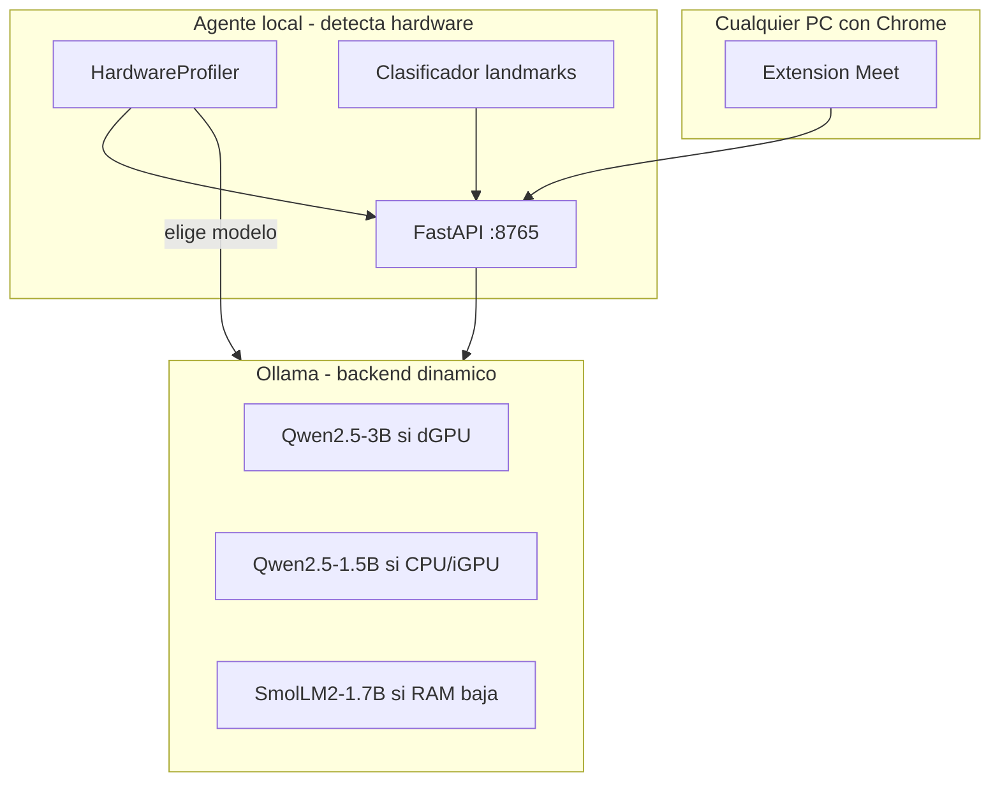

# Comparativa exhaustiva de LLM open source para el módulo semántico LSA

Documento técnico del proyecto **2026_Proyecto_LSA** — rama `modulo-semantico`.

**Objetivo:** elegir y desplegar un LLM que convierta **glosas LSA → español argentino** en un **agente local** consumido por una **extensión de navegador** (Google Meet, etc.), funcionando en **PCs heterogéneas**: con GPU dedicada (dGPU), con GPU integrada (iGPU) o **solo CPU**.

**Restricciones del proyecto:** procesamiento 100% local (RNF-02), latencia razonable (RNF-01), licencia permisiva, adaptación few-shot + LoRA (Low Rank Adaptation) opcional.

**Última actualización:** julio 2026 (revisión: soporte CPU / iGPU / extensión web).

---

## Tabla de contenidos

1. [Contexto: extensión web en PCs distintas](#1-contexto-extensión-web-en-pcs-distintas)
2. [Perfiles de hardware y requisitos mínimos](#2-perfiles-de-hardware-y-requisitos-mínimos)
3. [Conceptos técnicos del LLM (resumen)](#3-conceptos-técnicos-del-llm-resumen)
4. [Cómo corre el LLM según el tipo de GPU](#4-cómo-corre-el-llm-según-el-tipo-de-gpu)
5. [Infraestructura: agente local + extensión](#5-infraestructura-agente-local--extensión)
6. [Licencias open source](#6-licencias-open-source)
7. [Modelos evaluados (ficha individual)](#7-modelos-evaluados-ficha-individual)
8. [Cuadro comparativo global](#8-cuadro-comparativo-global)
9. [Estrategia multi-perfil y recomendación final](#9-estrategia-multi-perfil-y-recomendación-final)
10. [Referencias y enlaces](#10-referencias-y-enlaces)

---

## 1. Contexto: extensión web en PCs distintas

### 1.1 Por qué esto cambia la elección del LLM

La versión anterior de este documento asumía **GPU dedicada NVIDIA de 8 GB**. En la realidad del despliegue con extensión de navegador:

| Situación típica | % estimado usuarios | Implicancia |
|------------------|---------------------|-------------|
| Notebook office: **solo CPU** + Intel UHD / AMD Vega iGPU | Alta | LLM corre en **RAM del sistema**, no en VRAM dedicada |
| Notebook multimedia: **iGPU** con RAM compartida | Alta | Ollama puede ignorar la iGPU; a menudo cae a CPU |
| PC gamer / estación: **NVIDIA/AMD dGPU** | Media | Mejor caso; modelos 3B Q4 fluidos |
| Apple Silicon (M1/M2/M3) | Media en algunos entornos | Memoria unificada; Ollama muy eficiente |
| PC antigua 8 GB RAM | Baja pero existe | Solo modelos ≤1.7B Q4; calidad limitada |

**Conclusión de diseño:** no se elige **un solo modelo fijo** para todas las máquinas. Se define:

1. Un **modelo recomendado por defecto** (máxima calidad en hardware típico del TFG)
2. Una **cadena de fallback** automática según RAM/GPU detectada
3. **Requisitos mínimos** documentados en el popup de la extensión

### 1.2 Qué NO corre en el navegador

La extensión Chrome **no ejecuta el LLM**. Solo muestra subtítulos y habla con `http://127.0.0.1:8765`. El usuario debe instalar:

- **Agente local** (Python + FastAPI + clasificador + Ollama)
- **Ollama** como runtime del LLM

Esto permite que la misma extensión funcione en cualquier PC que cumpla los requisitos mínimos del agente, independientemente del SO (Windows 10/11 principalmente).

### 1.3 Diagrama de despliegue heterogéneo



---

## 2. Perfiles de hardware y requisitos mínimos

### 2.1 Cuatro perfiles (Tiers)

| Tier | Nombre | Hardware típico | RAM mínima | GPU | Modelo LLM | Latencia LLM* | ¿Viable TFG? |
|------|--------|-------------------|------------|-----|------------|---------------|--------------|
| **T0** | Mínimo absoluto | Celeron / 8 GB, sin AVX2 reciente | 8 GB | CPU | SmolLM2-1.7B Q4 | 8–20 s | Marginal; calidad baja |
| **T1** | Office / iGPU ignorada | Ryzen 5 / i5, 16 GB, Intel UHD | 16 GB | CPU (Ollama) | **Qwen2.5-1.5B Q4** | 3–10 s | **Sí (objetivo base extensión)** |
| **T2** | iGPU aprovechada / APU | Ryzen 7 7840HS, 32 GB, VRAM BIOS 8G | 16–32 GB | AMD iGPU / Apple M | Qwen2.5-3B Q4 | 1–4 s | Sí (config manual Linux) |
| **T3** | GPU dedicada | RTX 3060–4060 8–12 GB | 16 GB | NVIDIA dGPU | **Qwen2.5-3B Q4** | 0.5–2 s | **Sí (desarrollo / óptimo)** |

\* Latencia solo del LLM para generar ~30 tokens, tras pausa de señado del usuario. En CPU depende mucho de núcleos y DDR4 vs DDR5.

### 2.2 Requisitos mínimos oficiales propuestos (extensión + agente)

| Recurso | Mínimo (T0) | Recomendado (T1) | Óptimo (T3) |
|---------|-------------|------------------|-------------|
| **RAM** | 8 GB | **16 GB** | 16 GB |
| **CPU** | 4 núcleos, AVX2 | 6+ núcleos modernos | 6+ núcleos |
| **GPU** | Ninguna requerida | iGPU o CPU | NVIDIA 6 GB+ VRAM |
| **Disco libre** | 5 GB | 8 GB | 10 GB |
| **SO** | Windows 10 64b / Linux | Windows 11 / Ubuntu 22.04+ | Igual |
| **Red** | Solo localhost | Solo localhost | Solo localhost |
| **Chrome** | Versión 120+ (MV3) | Igual | Igual |

**Regla de RAM para elegir modelo (Ollama CPU):**

```
RAM_libre ≈ RAM_total − 4 GB (SO + agente + clasificador + navegador)
Tamaño_modelo_Q4 ≤ 60% × RAM_libre   [fuente: guías Ollama mini PC]
```

Ejemplo: PC con 16 GB → ~12 GB libres → modelos Q4 ≤ ~7 GB → caben 3B Q4 (~2 GB) con holgura; el límite en T1 es **velocidad CPU**, no RAM.

### 2.3 CPU integrada vs GPU dedicada vs iGPU

| Tipo | Qué es | Cómo lo usa Ollama | VRAM | Velocidad típica 3B Q4 |
|------|--------|-------------------|------|------------------------|
| **CPU only** | Ryzen/Intel sin tarjeta aparte | `llama.cpp` multihilo, AVX2/AVX-512 | Usa **RAM** (~3–4 GB) | 3–12 tok/s |
| **iGPU Intel UHD/Iris** | GPU dentro del chip Intel | En Windows: **casi siempre CPU** | RAM compartida | ≈ CPU |
| **iGPU AMD Radeon** | Vega / RDNA en APU | Experimental; Linux+ROCm+env vars | VRAM BIOS + GTT | 5–20 tok/s si funciona |
| **dGPU NVIDIA** | GTX/RTX separada | CUDA vía Ollama | **VRAM dedicada** | 20–60 tok/s |
| **Apple Silicon** | M1/M2/M3 unificada | Metal; memoria unificada | RAM compartida eficiente | 15–40 tok/s |

Fuentes: [Ollama hardware guide](https://www.autolearningagents.com/ollama/ollama-hardware.php), [Ollama AMD iGPU issue #2637](https://github.com/ollama/ollama/issues/2637), [Running Ollama on AMD iGPU](https://blog.machinezoo.com/Running_Ollama_on_AMD_iGPU).

### 2.4 Impacto en el clasificador + LLM simultáneos

| Config | Clasificador (PyTorch) | LLM (Ollama) | Conviven? |
|--------|------------------------|--------------|-----------|
| T3 dGPU 8 GB | GPU ~1.5 GB | GPU ~2.5 GB | **Sí** en la misma GPU |
| T1 CPU 16 GB | CPU o GPU si hay | **CPU** ~3 GB RAM | **Sí** (ambos en CPU/RAM) |
| T0 8 GB | CPU | CPU ~1.2 GB (SmolLM2) | Justo; cerrar apps |

En **T1 (solo CPU)**, conviene ejecutar **clasificador en CPU** también para no competir por una iGPU no detectada. Latencia total mayor pero funcional para videollamada asistida (no tiempo real estricto).

---

## 3. Conceptos técnicos del LLM (resumen)

### 3.1 Qué hace en este proyecto

Entrada: `YO NOMBRE JUAN` (+ contexto conversacional)  
Salida: `Me llamo Juan.`

El LLM **no ve video**; solo texto (glosas). Es un modelo **causal decoder-only Transformer** entrenado para predecir el siguiente token.

### 3.2 Tokens, contexto y memoria

| Concepto | Impacto en extensión |
|----------|---------------------|
| **Token** | Subunidad de texto; prompt completo ≈ 800–2500 tokens |
| **Contexto** | Todo lo que entra en una inferencia; más largo = más RAM y más lento en CPU |
| **KV cache** | Memoria extra durante generación; +0.5–1.5 GB en prompts largos |
| **Cuantización Q4** | Reduce pesos ~4× vs FP16; esencial en CPU/iGPU |

### 3.3 Parámetros de inferencia recomendados (todos los tiers)

```python
LLM_TEMPERATURE = 0.1      # menos alucinaciones
LLM_MAX_TOKENS = 80        # oraciones cortas LSA
LLM_TOP_P = 0.9
```

### 3.4 Adaptación sin entrenar desde cero

| Fase | Método | Hardware |
|------|--------|----------|
| 1 | Few-shot (15–20 ejemplos en prompt) | Cualquier tier |
| 2 | LoRA/QLoRA sobre Qwen2.5-3B o 1.5B | PC con GPU 8 GB+ o Google Colab para entrenar; adapter portable |

---

## 4. Cómo corre el LLM según el tipo de GPU

### 4.1 Modo CPU (fallback universal)

Ollama detecta ausencia de GPU compatible y usa **CPU** automáticamente.

**Optimizaciones:**

```bash
# Windows / Linux — ajustar hilos a núcleos físicos performance
set OLLAMA_NUM_THREADS=6        # Windows CMD
export OLLAMA_NUM_THREADS=6       # Linux/macOS
```

**Variables útiles:**

| Variable | Efecto |
|----------|--------|
| `OLLAMA_NUM_THREADS` | Hilos CPU; ≈ núcleos P-cores |
| `OLLAMA_MAX_LOADED_MODELS` | Modelos en memoria simultáneos (default 1 OK) |
| `OLLAMA_KEEP_ALIVE` | Mantener modelo cargado entre traducciones |

Fuente: [Run Ollama on Mini PC](https://ai-desk.tech/guides/run-ollama-on-mini-pc), [Ollama hardware](https://www.autolearningagents.com/ollama/ollama-hardware.php).

### 4.2 iGPU AMD (experimental)

Requisitos típicos (Linux; Windows más limitado):

- Kernel 6.10+ recomendado
- BIOS: asignar VRAM iGPU ≥ 4 GB (si Ollama no detecta iGPU con 512 MB default)
- Variables: `HSA_OVERRIDE_GFX_VERSION`, `OLLAMA_VULKAN=1` según generación

**Para el TFG:** documentar como **opcional / avanzado**; no basar el flujo principal en iGPU AMD en Windows.

### 4.3 iGPU Intel

Ollama en Windows con Intel UHD/Iris **generalmente no acelera** el LLM; se trata como **Tier T1 CPU**. Excepción: algunos setups Intel Arc como dGPU.

### 4.4 dGPU NVIDIA

Mejor escenario. Instalar drivers + CUDA. Ollama autodetecta. Permite **Qwen2.5-3B Q4 + clasificador** en paralelo.

### 4.5 Apple Silicon (macOS)

Memoria unificada: `Qwen2.5-3B` corre bien en M1 16 GB. Misma extensión Chrome + agente Python + Ollama macOS. Tier T2/T3 según chip.

---

## 5. Infraestructura: agente local + extensión

### 5.1 Stack

```
Chrome Extension (MV3)  →  FastAPI :8765  →  Ollama :11434  →  GGUF/Q4
                         ↘  Clasificador PyTorch (webcam)
```

### 5.2 Detección automática de perfil (implementación futura)

```python
class HardwareTier(Enum):
    T0_MINIMAL = "smollm2:1.7b"
    T1_CPU = "qwen2.5:1.5b"
    T2_IGPU = "qwen2.5:3b"      # si ollama reporta GPU
    T3_DGPU = "qwen2.5:3b"

def detect_tier() -> HardwareTier:
    ram_gb = psutil.virtual_memory().total / 1e9
    gpu = ollama_client.show_gpu()  # ps / api / nvidia-smi
    if ram_gb < 12:
        return T0_MINIMAL
    if gpu is None or gpu.vram_mb < 4096:
        return T1_CPU
    return T3_DGPU
```

La extensión consulta `GET /api/v1/health` y recibe `{ "tier": "T1", "model": "qwen2.5:1.5b", "ready": true }`.

### 5.3 Latencia percibida en videollamada

| Componente | T1 CPU | T3 dGPU |
|------------|--------|---------|
| Clasificación 1 glosa | 0.3–0.8 s | 0.1–0.3 s |
| Pausa usuario (fin oración) | 2 s (config) | 2 s |
| LLM traducción | 3–10 s | 0.5–2 s |
| **Total percibido** | **5–13 s** | **3–5 s** |

RNF-01 (<2 s) **no se cumple en T1 CPU** para el LLM solo; el protocolo acordado con la experta (pausa larga entre oraciones) amortigua la espera. Documentar en TFG como limitación de hardware consumer sin GPU.

---

## 6. Licencias open source

| Categoría | Licencia | OSI | Uso TFG / extensión | Modelos |
|-----------|----------|-----|---------------------|---------|
| **A — Libre pleno** | Apache 2.0, MIT | Sí | Sin restricciones relevantes | Qwen2.5, Qwen3, Mistral 7B, SmolLM2, OLMo 2, Phi-3 |
| **B — Open weights custom** | Llama Community, Gemma Terms | No | Comercial OK; cláusulas extra | Llama 3.2, Gemma 2 |

Para producto extensión + agente open source: **preferir Categoría A**.

Enlaces: [Apache 2.0](https://www.apache.org/licenses/LICENSE-2.0), [Llama 3.2 License](https://github.com/meta-llama/llama-models/blob/main/models/llama3_2/LICENSE), [Gemma Terms](https://ai.google.dev/gemma/terms).

---

## 7. Modelos evaluados (ficha individual)

Criterios ampliados: **español**, **licencia**, **RAM/VRAM Q4**, **tok/s CPU**, **tok/s GPU**, **calidad gloss→ES**, **Ollama tag**.

---

### 7.1 Qwen2.5-3B-Instruct — Tier T2/T3 (calidad máxima)

| Campo | Valor |
|-------|-------|
| Parámetros | 3.09B |
| Licencia | Apache 2.0 |
| Disco Ollama | ~2.0 GB (`qwen2.5:3b`) |
| RAM/VRAM Q4 | ~2.2 GB pesos + ~1 GB KV |
| Contexto | 32 768 tokens |
| CPU 6 cores | ~4–8 tok/s |
| dGPU RTX 3060 | ~25–40 tok/s |
| Español | Excelente |
| HF | https://huggingface.co/Qwen/Qwen2.5-3B-Instruct |

**Ventajas:** Mejor gloss→español en 3B; Apache 2.0; 32K contexto.  
**Desventajas:** Lento en CPU-only; no usar como único modelo en extensión universal.  
**Cuándo:** PC con NVIDIA ≥6 GB VRAM o Apple M con 16 GB+.

---

### 7.2 Qwen2.5-1.5B-Instruct — Tier T1 (recomendado CPU / extensión base)

| Campo | Valor |
|-------|-------|
| Parámetros | 1.54B |
| Licencia | Apache 2.0 |
| Disco Ollama | ~1.0 GB (`qwen2.5:1.5b`) |
| RAM Q4 | ~1.0 GB pesos + KV |
| Contexto | 32 768 tokens |
| CPU 6 cores | ~8–15 tok/s |
| Español | Bueno (mejor que SmolLM2, algo menor que 3B) |
| HF | https://huggingface.co/Qwen/Qwen2.5-1.5B-Instruct |

**Ventajas:** Misma familia multilingüe que 3B; **mitad de RAM**; aceptable en 16 GB sin GPU; misma licencia; mismo pipeline LoRA.  
**Desventajas:** Más errores gramaticales en oraciones largas o deletreo.  
**Cuándo:** **Default para extensión en PCs office sin dGPU.**

---

### 7.3 Qwen3-4B-Instruct-2507 — Tier T2+ (reserva calidad)

| Campo | Valor |
|-------|-------|
| Parámetros | 4.0B |
| Licencia | Apache 2.0 |
| RAM/VRAM Q4 | ~3.9 GB |
| Contexto | 262 144 tokens |
| HF | https://huggingface.co/Qwen/Qwen3-4B-Instruct-2507 |

**Ventajas:** Mejor instruction following (2025).  
**Desventajas:** Pesado para CPU; justo en 8 GB dGPU + clasificador.  
**Cuándo:** Máquinas con 12 GB VRAM o Apple M2 Pro+.

---

### 7.4 Phi-3-mini-4k-instruct — Tier T1 alternativo

| Campo | Valor |
|-------|-------|
| Parámetros | 3.8B |
| Licencia | MIT |
| RAM Q4 | ~2.5 GB |
| Contexto | **4 096** (justo para few-shot largo) |
| CPU | ~5–10 tok/s |
| Español | Bueno, inferior a Qwen en parafraseo ES |
| HF | https://huggingface.co/microsoft/Phi-3-mini-4k-instruct |

**Ventajas:** MIT; muy documentado.  
**Desventajas:** Contexto 4K limitado; más lento que Qwen2.5-1.5B en CPU por más parámetros.  
**Cuándo:** Fallback si Qwen no corre en Ollama del usuario.

---

### 7.5 Llama 3.2-3B-Instruct — Tier T1/T2

| Campo | Valor |
|-------|-------|
| Parámetros | 3.21B |
| Licencia | Llama 3.2 Community (no OSI) |
| RAM Q4 | ~2.0 GB |
| Español | Soportado oficialmente; calidad < Qwen2.5 |
| Ollama | `llama3.2:3b` |

**Ventajas:** Muy eficiente; 2 GB en disco.  
**Desventajas:** Licencia custom; atribución "Built with Llama".

---

### 7.6 SmolLM2-1.7B-Instruct — Tier T0 (mínimo absoluto)

| Campo | Valor |
|-------|-------|
| Parámetros | 1.71B |
| Licencia | Apache 2.0 |
| RAM Q4 | ~1.2 GB |
| CPU | ~10–20 tok/s (rápido por tamaño) |
| Español | **Regular** — muchos errores gloss→ES |
| HF | https://huggingface.co/HuggingFaceTB/SmolLM2-1.7B-Instruct |
| Paper | https://arxiv.org/abs/2502.02737 |

**Ventajas:** Corre en 8 GB RAM; útil para demo / prueba de extensión.  
**Desventajas:** Calidad semántica insuficiente para producción LSA.  
**Cuándo:** Solo T0 o pruebas de conectividad extensión↔agente.

---

### 7.7 Gemma 2-2B-it — No recomendado ES

| Campo | Valor |
|-------|-------|
| Licencia | Gemma Terms (no OSI) |
| Entrenamiento | Predominio inglés |
| Español | Regular |

**Veredicto:** Descartado para módulo semántico LSA→ES.

---

### 7.8 Mistral 7B Instruct v0.3 — Solo T3 dedicado

| Campo | Valor |
|-------|-------|
| Licencia | Apache 2.0 |
| VRAM Q4 | ~4.6 GB |
| CPU | Impracticable interactivo (~2–5 tok/s, 3 GB+ swap) |

**Veredicto:** No usar con clasificador en 8 GB; descartado para perfil universal.

---

### 7.9 OLMo-2-1B-Instruct — Académico EN

Fully open (datos + código). Español pobre. Solo referencia reproducibilidad científica.

---

## 8. Cuadro comparativo global

| Modelo | Params | Licencia OSI | Español | RAM Q4 | CPU 16GB | dGPU 8GB | Contexto | Calidad gloss→ES | Tier | Puntaje extensión universal |
|--------|--------|--------------|---------|--------|----------|----------|----------|------------------|------|----------------------------|
| **Qwen2.5-1.5B-Instruct** | 1.5B | Apache 2.0 | Bueno | 1.0 GB | **Excelente** | Sobrado | 32K | 7.5/10 | **T1 default** | **92** |
| **Qwen2.5-3B-Instruct** | 3.1B | Apache 2.0 | Excelente | 2.2 GB | Lento | **Ideal** | 32K | **9/10** | **T3 óptimo** | 88† |
| Qwen3-4B-Instruct | 4.0B | Apache 2.0 | Excelente | 3.9 GB | Muy lento | Justo | 256K | 9/10 | T2+ | 75 |
| Phi-3-mini-4k | 3.8B | MIT | Bueno | 2.5 GB | Lento | OK | **4K** | 7/10 | T1 alt | 70 |
| Llama 3.2-3B | 3.2B | Custom | Bueno | 2.0 GB | Lento | OK | 128K‡ | 7.5/10 | T1 alt | 68 |
| SmolLM2-1.7B | 1.7B | Apache 2.0 | Regular | 1.2 GB | Rápido | OK | 8K | 5/10 | T0 | 45 |
| Gemma 2-2B | 2.6B | Custom | Regular | 1.5 GB | Rápido | OK | 8K | 5/10 | — | 40 |
| Mistral 7B | 7.3B | Apache 2.0 | Bueno | 4.6 GB | No viable | Justo | 32K | 8/10 | — | 35 |

† Puntaje alto en calidad pero **no universal** por dependencia GPU.  
‡ Contexto efectivo en Ollama quant often 8K.

### 8.1 Matriz tier → modelo → expectativa

| Tier | Hardware | Modelo Ollama | tok/s aprox. | Calidad ES | Instalación usuario |
|------|----------|---------------|--------------|------------|---------------------|
| T0 | 8 GB, CPU vieja | `smollm2:1.7b` | 10–20 | Baja | `ollama pull smollm2:1.7b` |
| **T1** | **16 GB, sin dGPU** | **`qwen2.5:1.5b`** | **8–15** | **Media-alta** | **`ollama pull qwen2.5:1.5b`** |
| T2 | 16–32 GB, iGPU/Mac | `qwen2.5:3b` | 5–20 | Alta | `ollama pull qwen2.5:3b` |
| **T3** | **dGPU 6 GB+** | **`qwen2.5:3b`** | **25–50** | **Alta** | **`ollama pull qwen2.5:3b`** |

---

## 9. Estrategia multi-perfil y recomendación final

### 9.1 Dos modelos oficiales del proyecto (no uno solo)

| Rol | Modelo | Motivo |
|-----|--------|--------|
| **Universal (extensión / CPU)** | **Qwen2.5-1.5B-Instruct** | Cabe en 16 GB sin GPU; español aceptable; Apache 2.0; LoRA posible |
| **Óptimo (dev / dGPU)** | **Qwen2.5-3B-Instruct** | Máxima calidad gloss→ES cuando hay VRAM |

El agente y la extensión deben soportar **ambos** con selección automática o manual en popup ("Modo calidad" / "Modo compatible").

### 9.2 Por qué ya no es solo Qwen2.5-3B

La versión anterior recomendaba únicamente 3B asumiendo GPU 8 GB. Para extensión en **cualquier PC**:

- Muchos usuarios **no tienen dGPU**
- iGPU **no garantiza** aceleración en Windows
- 3B en CPU → 5–15 s por traducción → frustrante sin pausa larga
- 1.5B en CPU → **~2× más rápido** con pérdida de calidad moderada (aceptable con few-shot fuerte)

### 9.3 Cadena de fallback recomendada

```
1. Intentar qwen2.5:3b  si GPU detectada y VRAM ≥ 4 GB
2. Si no → qwen2.5:1.5b  si RAM ≥ 12 GB
3. Si no → smollm2:1.7b  si RAM ≥ 8 GB (modo degradado + aviso UI)
4. Si no → deshabilitar módulo semántico; solo glosas en overlay
```

### 9.4 Plan de adaptación (few-shot + LoRA)

| Fase | Modelo base sugerido | Hardware entrenamiento |
|------|---------------------|------------------------|
| Few-shot | 1.5B (universal) y 3B (validación) | Cualquiera |
| LoRA | `Qwen/Qwen2.5-1.5B-Instruct` **primero** (adapter ~30 MB, portable a todos los tiers) | GPU 8 GB o Colab |
| LoRA opcional 3B | Si 1.5B no alcanza chrF meta | GPU 8 GB |

Entrenar LoRA en 3B y desplegar solo en T3; entrenar LoRA en 1.5B para **todos los usuarios de extensión**.

### 9.5 Checklist instalación usuario (README extensión)

1. Instalar [Ollama](https://ollama.com) (Windows / macOS / Linux)
2. Ejecutar detector o manual:
   - Sin GPU: `ollama pull qwen2.5:1.5b`
   - Con GPU NVIDIA: `ollama pull qwen2.5:3b`
3. Instalar agente LSA (Python + dependencias)
4. Instalar extensión Chrome → verificar `GET http://127.0.0.1:8765/api/v1/health`
5. Abrir Meet → overlay muestra tier y modelo activo

### 9.6 Resumen ejecutivo

| Pregunta | Respuesta |
|----------|-----------|
| ¿Un solo LLM para todas las PCs? | **No.** Perfil dual 1.5B (CPU) + 3B (GPU) |
| ¿Funciona sin placa de video? | **Sí**, con Qwen2.5-1.5B y 16 GB RAM |
| ¿Funciona con iGPU? | **A veces**; tratar como CPU salvo Linux+AMD configurado |
| ¿Mejor calidad absoluta? | Qwen2.5-3B en dGPU |
| ¿Mejor para extensión universal? | **Qwen2.5-1.5B-Instruct** |
| ¿Licencia? | Apache 2.0 (ambos) |

---

## 10. Referencias y enlaces

### Hardware y Ollama

| Recurso | URL |
|---------|-----|
| Ollama — descarga | https://ollama.com |
| Ollama model library | https://ollama.com/library |
| Hardware requirements Ollama | https://www.autolearningagents.com/ollama/ollama-hardware.php |
| Mini PC / CPU guide | https://ai-desk.tech/guides/run-ollama-on-mini-pc |
| AMD iGPU support (issue) | https://github.com/ollama/ollama/issues/2637 |
| AMD iGPU tutorial (PR) | https://github.com/ollama/ollama/pull/5426 |
| AMD iGPU blog | https://blog.machinezoo.com/Running_Ollama_on_AMD_iGPU |

### Modelos

| Modelo | Hugging Face | Ollama |
|--------|--------------|--------|
| Qwen2.5-3B-Instruct | https://huggingface.co/Qwen/Qwen2.5-3B-Instruct | https://ollama.com/library/qwen2.5 |
| Qwen2.5-1.5B-Instruct | https://huggingface.co/Qwen/Qwen2.5-1.5B-Instruct | https://ollama.com/library/qwen2.5 |
| Qwen3-4B-Instruct-2507 | https://huggingface.co/Qwen/Qwen3-4B-Instruct-2507 | https://ollama.com/library/qwen3 |
| Phi-3-mini-4k | https://huggingface.co/microsoft/Phi-3-mini-4k-instruct | https://ollama.com/library/phi3 |
| Llama 3.2-3B | https://huggingface.co/meta-llama/Llama-3.2-3B | https://ollama.com/library/llama3.2 |
| SmolLM2-1.7B | https://huggingface.co/HuggingFaceTB/SmolLM2-1.7B-Instruct | https://ollama.com/library/smollm2 |

### Papers y proyecto LSA

| Recurso | URL |
|---------|-----|
| Qwen2.5 Technical Report | https://arxiv.org/abs/2412.15115 |
| Phi-3 Technical Report | https://arxiv.org/abs/2404.14219 |
| SmolLM2 Paper | https://arxiv.org/abs/2502.02737 |
| Camgöz — Gloss→Text (SLT) | https://arxiv.org/abs/1808.03373 |
| Plan módulo semántico | [plan_modulo_semantico.md](plan_modulo_semantico.md) |
| Informe TFG | [Informe.tex](Informe.tex) |

---

*Este documento prioriza despliegue heterogéneo para extensión de navegador. Validar latencia en hardware objetivo con:*

```bash
ollama run qwen2.5:1.5b "Traducí al español argentino estas glosas LSA: YO NOMBRE JUAN"
ollama run qwen2.5:3b "Traducí al español argentino estas glosas LSA: YO NOMBRE JUAN"
```

*Medir tiempo hasta fin de respuesta y calidad con experta LSA antes de fijar tier default en producción.*
