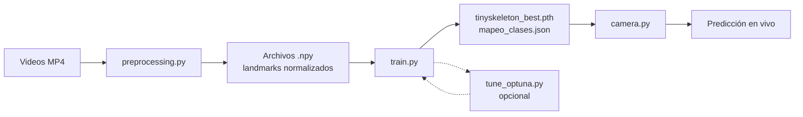

# Proyecto LSA — Reconocimiento de Lengua de Señas Argentina

Documentación técnica del pipeline completo: extracción de landmarks, entrenamiento, inferencia en tiempo real y búsqueda de hiperparámetros.

---

## Tabla de contenidos

1. [Visión general](#visión-general)
2. [Flujo del sistema](#flujo-del-sistema)
3. [Estructura del proyecto](#estructura-del-proyecto)
4. [Scripts y módulos](#scripts-y-módulos)
5. [Gráficos generados](#gráficos-generados)
6. [Decisiones de diseño](#decisiones-de-diseño)
7. [Mejoras implementadas](#mejoras-implementadas)
8. [Configuración (`config.py`)](#configuración-configpy)
9. [Flujo de trabajo recomendado](#flujo-de-trabajo-recomendado)
10. [Referencias y bibliografía](#referencias-y-bibliografía)

---

## Visión general

Este proyecto implementa un **clasificador de señas de LSA** a partir de video. No trabaja directamente con píxeles: primero extrae un **esqueleto corporal** (pose + manos) con MediaPipe, lo normaliza espacialmente y luego alimenta una red **Conv1D + Transformer** que clasifica la seña.

**Entrada:** video MP4 (offline) o webcam (tiempo real).  
**Salida:** nombre de la seña predicha + nivel de confianza.

**Restricción de dataset:** solo se entrenan clases con **≥ 50 videos** por categoría (`SAMPLES_PER_CLASS`). Las demás se descartan automáticamente en `train.py`.

---

## Flujo del sistema



| Etapa | Descripción |
|-------|-------------|
| **Preprocesamiento** | MP4 → secuencia fija de landmarks `(MAX_FRAMES, 225)` |
| **Entrenamiento** | Aprende a clasificar secuencias; guarda pesos y mapeo de clases |
| **Inferencia** | Webcam → captura gesto → misma normalización → predicción |
| **Optuna** (opcional) | Busca hiperparámetros óptimos con validación cruzada |

---

## Estructura del proyecto

```
2026_Proyecto_LSA/
├── dataset/                    # Videos MP4 por carpeta de clase
├── dataset_landmarks_32/       # Landmarks extraídos (.npy)
├── docs/
│   └── documentacion.md        # Este archivo
└── src/
    ├── config.py               # Hiperparámetros y rutas
    ├── preprocessing.py        # Extracción masiva de landmarks
    ├── utils.py                # Normalización espacial/temporal
    ├── model_arch.py           # Arquitectura de la red
    ├── train.py                # Entrenamiento y evaluación
    ├── camera.py               # Inferencia en tiempo real
    ├── tune_optuna.py          # Búsqueda de hiperparámetros
    └── model/
        ├── tinyskeleton_best.pth
        └── mapeo_clases.json
```

---

## Scripts y módulos

### `config.py`

**Para qué sirve:** centraliza rutas, lista de clases, hiperparámetros del modelo, opciones de entrenamiento y parámetros de captura en cámara.

**No se ejecuta directamente.** Lo importan todos los demás módulos.

---

### `preprocessing.py`

**Para qué sirve:** convierte el dataset de videos en tensores NumPy listos para entrenar.

**Qué hace:**
1. Recorre cada carpeta de clase en `dataset/`.
2. Por cada video MP4, extrae landmarks con **MediaPipe Holistic** (pose + manos).
3. Normaliza espacialmente cada frame (ancla en hombros, escala inter-hombros).
4. Aplica **subsampleo uniforme** a `MAX_FRAMES` frames.
5. Guarda un `.npy` por video en `dataset_landmarks_32/<clase>/`.

**Ejecución:**
```bash
cd src
python preprocessing.py
```

**Salida:** archivos `.npy` de forma `(MAX_FRAMES, FRAME_FEATURES_DIM)` — por defecto `(16, 225)`.

---

### `utils.py`

**Para qué sirve:** funciones compartidas de geometría y tiempo. No tiene `main`.

| Función | Rol |
|---------|-----|
| `get_anchor_and_scale()` | Calcula centro (hom bros) y escala de referencia |
| `normalize_spatial_points()` | Traslada y escala landmarks al espacio normalizado |
| `uniform_subsampling()` | Comprime una secuencia variable a N frames equiespaciados |
| `normalize_sequence_to_frames()` | Alinea cualquier `.npy` a `MAX_FRAMES` (subsampleo o padding) |
| `compute_landmark_hand_motion()` | Mide movimiento entre frames (solo manos) |
| `trim_gesture_buffer()` | Recorta silencio al inicio/fin antes de inferir |

---

### `model_arch.py`

**Para qué sirve:** define la arquitectura `TinySkeletonClassifier`, usada por `train.py` y `camera.py`.

**Arquitectura:**

```
Entrada (B, T, 225)
    → Conv1D × 2 + BatchNorm + ReLU
    → Positional Encoding (sinusoidal)
    → Transformer Encoder (num_layers capas)
    → Attention Pooling (peso por frame)
    → Dropout + Linear
    → Logits (B, num_clases)
```

**Por qué está en un archivo aparte:** evita duplicar la definición del modelo en entrenamiento e inferencia.

---

### `train.py`

**Para qué sirve:** entrena el clasificador y evalúa en el conjunto de validación.

**Qué hace:**
1. **Filtra clases** con menos de 50 videos.
2. Toma hasta 50 videos por clase, shuffle con semilla 42.
3. Split **80 % train / 20 % val** por clase.
4. Carga secuencias con `normalize_sequence_to_frames()` (subsampleo uniforme, no truncado al inicio).
5. Entrena con AdamW, CrossEntropy + label smoothing, ReduceLROnPlateau y early stopping.
6. Guarda el mejor modelo y `mapeo_clases.json`.
7. Genera gráficos de curva de aprendizaje y matriz de confusión.

**Data augmentation** (si `USE_DATA_AUGMENTATION = True`):
- `augment_batch_3d()`: ruido gaussiano + escala aleatoria en coordenadas 3D.
- `VIRTUAL_MULTIPLIER`: repite virtualmente cada muestra N veces por época.

**Ejecución:**
```bash
cd src
python train.py
```

**Salidas:**
| Archivo | Descripción |
|---------|-------------|
| `model/tinyskeleton_best.pth` | Pesos del mejor modelo (menor val loss) |
| `model/mapeo_clases.json` | Diccionario `{nombre_seña: índice}` |
| `curva_tinyskeleton.png` | Curva train/val loss |
| `matriz_confusion_tinyskeleton.png` | Matriz de confusión en validación |

---

### `camera.py`

**Para qué sirve:** reconocimiento de señas en **tiempo real** con webcam.

**Qué hace:**
1. Carga el modelo y `mapeo_clases.json`.
2. Captura frames en un hilo separado (`WebcamStream`).
3. MediaPipe Holistic por frame.
4. **Máquina de estados de captura:**
   - **Modo `auto`:** inicia con movimiento (píxeles o landmarks) **o** con manos visibles N frames (señas estáticas).
   - **Modo `static` / `dynamic`:** forzado con tecla `m`.
5. Acumula frames en buffer → `trim_gesture_buffer()` → `uniform_subsampling()` → tensor.
6. Inferencia en hilo worker (`InferenceWorker`).
7. Muestra predicción si confianza > `CONFIDENCE_THRESHOLD`.

**Controles:**
| Control | Acción |
|---------|--------|
| `q` | Salir |
| `m` | Alternar modo captura: auto → static → dynamic |
| Botón **CAPTURAR** | Inferencia manual del buffer actual |
| Botón **Config** | Sliders de sensibilidad, confianza, corte por silencio |
| Botón **Esqueleto** | Mostrar/ocultar landmarks |

**Ejecución:**
```bash
cd src
python camera.py
```

---

### `tune_optuna.py`

**Para qué sirve:** búsqueda automática de hiperparámetros con [Optuna](https://optuna.org/).

**Qué hace:**
1. Usa las mismas clases válidas (≥ 50 videos).
2. **K-fold (3 splits)** sobre el 80 % de entrenamiento.
3. Prueba combinaciones de `hidden_dim`, `num_heads`, `num_layers`, `dropout`, `lr`, `weight_decay`, etc.
4. **Pruning:** corta trials malos antes de completar todas las épocas.
5. Persiste resultados en `optuna_study.db`.

**Cuándo usarlo:** después de validar que el pipeline base (train + camera) funciona razonablemente. No reemplaza un buen dataset ni un pipeline de captura alineado.

**Ejecución:**
```bash
pip install optuna
cd src
python tune_optuna.py
```

**Dashboard opcional:**
```bash
pip install optuna-dashboard
optuna-dashboard sqlite:///optuna_study.db
```

---

## Gráficos generados

### `curva_tinyskeleton.png`

**Qué muestra:** evolución del **loss** en entrenamiento y validación por época.

| Curva | Interpretación |
|-------|----------------|
| **Train Loss** ↓ | El modelo aprende los datos de entrenamiento |
| **Val Loss** ↓ | Generaliza bien |
| **Train ↓ pero Val ↑ o plano** | Posible **overfitting** → más dropout, augmentation o menos épocas |
| **Ambas altas y planas** | Subajuste o dataset insuficiente |

**Uso:** detectar cuándo conviene parar (early stopping) y si la augmentation ayudó.

---

### `matriz_confusion_tinyskeleton.png`

**Qué muestra:** matriz de confusión entre **todas las clases válidas** en el conjunto de validación (20 %).

| Lectura | Significado |
|---------|-------------|
| Diagonal fuerte | Clase bien clasificada |
| Fila i, columna j (i ≠ j) | La seña i se confunde con la j |
| Filas/columnas muy débiles | Clase problemática (pocos datos, gesto ambiguo, videos inconsistentes) |

**Uso:** priorizar qué clases necesitan más videos o revisión de grabación. Muy útil para letras/números visualmente similares.

---

## Decisiones de diseño

### 1. Landmarks en lugar de píxeles

**Decisión:** usar MediaPipe Holistic (pose + manos) en vez de CNN sobre imagen RGB.

**Motivo:**
- Menos parámetros y menos datos necesarios.
- Invariante parcial a fondo, ropa y luminosidad.
- Alineado con la literatura de *skeleton-based sign language recognition*.

**Trade-off:** depende de la calidad de detección de MediaPipe; si las manos salen del frame, la señal se degrada.

---

### 2. Normalización espacial por hombros

**Decisión:** centrar en el punto medio de los hombros y escalar por distancia inter-hombros.

**Motivo:** compensar distancia a cámara y posición del cuerpo en el encuadre.

**Referencia conceptual:** normalización de esqueleto habitual en reconocimiento de gestos ([Fang et al., skeleton-based SLR](https://arxiv.org/search/?query=skeleton+sign+language+recognition&searchtype=all)).

---

### 3. Secuencia temporal fija (`MAX_FRAMES = 16`)

**Decisión:** comprimir cualquier gesto a 16 frames con subsampleo uniforme.

**Motivo:**
- El Transformer requiere longitud fija.
- 16 frames ≈ medio segundo a 30 FPS — suficiente para micro-gestos si la captura es buena.
- Unifica preprocessing, train y cámara.

**Trade-off:** gestos muy largos pierden detalle temporal fino; gestos muy cortos pueden diluirse si el buffer tiene mucho silencio (mitigado con `trim_gesture_buffer()`).

---

### 4. Conv1D + Transformer “tiny”

**Decisión:** extractor convolucional temporal + `TransformerEncoder` pequeño (128 dim, 2 capas, 4 cabezas).

**Motivo:**
- Conv1D captura patrones locales en el tiempo.
- Transformer modela dependencias entre frames.
- Tamaño acotado para dataset pequeño (~50 videos × N clases).

**Alternativas descartadas (por ahora):** LSTM grande, modelos 3D CNN sobre video completo (más datos y GPU).

---

### 5. Attention pooling (en lugar de mean pooling)

**Decisión:** ponderar frames con una capa lineal + softmax antes de clasificar.

**Motivo:** en señas cortas/estáticas, no todos los frames aportan igual (transición vs pose sostenida). El promedio simple diluía la señal útil.

**Inspiración:** mecanismos de atención para agregación temporal ([Vaswani et al., 2017](https://arxiv.org/abs/1706.03762)).

---

### 6. Filtro de clases con &lt; 50 muestras

**Decisión:** descartar clases insuficientes antes de entrenar.

**Motivo:** con pocas muestras por clase, el modelo no generaliza y la matriz de confusión se vuelve ruidosa. Mejor menos clases pero estables.

---

### 7. Captura dual en cámara (`auto` / `static` / `dynamic`)

**Decisión:** no depender solo de movimiento de píxeles para iniciar grabación.

**Motivo:** las señas estáticas de LSA (letras, números) generan poco cambio en píxeles. El modo estático dispara con manos visibles unos frames seguidos.

**Componentes:**
- Movimiento de píxeles (frame differencing).
- Movimiento de landmarks de manos.
- Corte más rápido por silencio (`STILL_FRAMES_LIMIT = 10`).
- Trim del buffer antes del subsampleo.

---

### 8. Data augmentation 3D

**Decisión:** ruido + escala en coordenadas de landmarks, no flip horizontal arbitrario.

**Motivo:** el flip puede cambiar el significado en LSA (mano dominante, orientación). Ruido y escala simulan variación de distancia y tracking sin alterar la semántica.

---

### 9. Optuna con K-fold (no un solo split)

**Decisión:** validación cruzada de 3 folds dentro de Optuna.

**Motivo:** con poco dato, un único split 80/20 puede dar hiperparámetros “afortunados”. K-fold promedia el error y reduce overfitting a la validación.

---

## Mejoras implementadas

| Área | Antes | Después |
|------|-------|---------|
| **Frames train vs cámara** | Train truncaba los primeros 16 frames; preprocessing usaba 32 | `normalize_sequence_to_frames()` con subsampleo uniforme en todos lados |
| **Captura estáticas** | Solo disparo por movimiento de píxeles | Modo `auto` + trigger por manos + movimiento de landmarks |
| **Buffer en cámara** | Subsampleo directo con silencio incluido | `trim_gesture_buffer()` recorta inicio/fin |
| **Pooling** | Mean pooling | Attention pooling |
| **Modelo duplicado** | Definido en `train.py` y `camera.py` | Centralizado en `model_arch.py` |
| **Hiperparámetros** | Solo manual en `config.py` | `tune_optuna.py` opcional con K-fold y pruning |
| **Corte por silencio** | 25 frames (~0,8 s) | 10 frames (~0,3 s) |
| **Inferencia manual** | No existía | Botón CAPTURAR + tecla `m` para modos |

---

## Configuración (`config.py`)

### Rutas y dataset

| Parámetro | Valor por defecto | Descripción |
|-----------|-------------------|-------------|
| `DATASET_VIDEOS_DIR` | `../dataset` | Videos MP4 originales |
| `DATASET_NPY_DIR` | `../dataset_landmarks_32` | Landmarks procesados |
| `MODEL_SAVE_DIR` | `../src/model` | Pesos y mapeo |
| `SAMPLES_PER_CLASS` | `50` | Mínimo de videos para incluir una clase |
| `MAX_FRAMES` | `16` | Frames por secuencia (unificado) |

### Modelo

| Parámetro | Default | Descripción |
|-----------|---------|-------------|
| `HIDDEN_DIM` | `128` | Dimensión interna del Transformer |
| `NUM_HEADS` | `4` | Cabezas de atención (`HIDDEN_DIM % NUM_HEADS == 0`) |
| `NUM_LAYERS` | `2` | Capas del encoder |
| `DROPOUT_RATE` | `0.5` | Regularización |

### Entrenamiento

| Parámetro | Default | Descripción |
|-----------|---------|-------------|
| `USE_DATA_AUGMENTATION` | `True` | Activa ruido/escala por batch |
| `VIRTUAL_MULTIPLIER` | `10` | Repeticiones virtuales del dataset |
| `BATCH_SIZE` | `32` | Tamaño de lote |
| `EPOCHS` | `200` | Máximo de épocas |
| `PATIENCE` | `15` | Early stopping |

### Cámara

| Parámetro | Default | Descripción |
|-----------|---------|-------------|
| `CONFIDENCE_THRESHOLD` | `0.85` | Umbral para mostrar predicción |
| `CAPTURE_MODE` | `"auto"` | `auto`, `static` o `dynamic` |
| `STILL_FRAMES_LIMIT` | `10` | Frames quietos antes de inferir |
| `STATIC_HANDS_FRAMES_TO_START` | `4` | Frames con manos para iniciar (estático) |

---

## Flujo de trabajo recomendado

```bash
# 1. Entorno
conda activate tu_entorno

# 2. Extraer landmarks (si hay videos nuevos)
cd src
python preprocessing.py

# 3. Entrenar
python train.py

# 4. Probar en vivo
python camera.py

# 5. (Opcional) Buscar hiperparámetros
pip install optuna
python tune_optuna.py
# → copiar mejores params a config.py → volver a train.py
```

**Orden lógico:** preprocessing → train → camera → optuna (si hace falta afinar).

**Reentrenar obligatorio** si cambiás `model_arch.py` o `MAX_FRAMES`: los pesos viejos pueden ser incompatibles.

---

## Referencias y bibliografía

### Lengua de señas y LSA

- [INJU — Diccionario de Señas (Argentina)](https://senas.inju.gob.ar/) — referencia oficial de formas de las señas.
- [Pinedo et al., LSA y tecnología (revisión general)](https://www.scielo.org.ar/) — buscar “lengua de señas argentina reconocimiento” en SciELO.

### MediaPipe y extracción de esqueleto

- [MediaPipe Holistic — documentación oficial](https://google.github.io/mediapipe/solutions/holistic.html)
- [MediaPipe Pose Landmarks](https://google.github.io/mediapipe/solutions/pose.html)
- [MediaPipe Hands](https://google.github.io/mediapipe/solutions/hands.html)

### Transformers y atención

- Vaswani, A. et al. (2017). *Attention Is All You Need*. [arXiv:1706.03762](https://arxiv.org/abs/1706.03762)
- [PyTorch — TransformerEncoder](https://pytorch.org/docs/stable/generated/torch.nn.TransformerEncoder.html)
- [Positional Encoding (sinusoidal)](https://arxiv.org/abs/1706.03762) — sección 3.5 del paper original.

### Reconocimiento de lengua de señas con esqueleto

- [Búsqueda arXiv: skeleton sign language recognition](https://arxiv.org/search/?query=skeleton+sign+language+recognition&searchtype=all)
- [WLASL Dataset (metodología de referencia internacional)](https://dxli94.github.io/WLASL/) — útil por enfoque y baseline, aunque no es LSA.
- [Sign Language Recognition: A Deep Survey](https://arxiv.org/search/?query=sign+language+recognition+survey&searchtype=all) — surveys recientes en arXiv.

### Regularización y dataset pequeño

- Srivastava, N. et al. (2014). *Dropout: A Simple Way to Prevent Neural Networks from Overfitting*. [JMLR](https://jmlr.org/papers/volume15/srivastava14a/srivastava14a.pdf)
- [Scikit-learn — Cross-validation](https://scikit-learn.org/stable/modules/cross_validation.html)
- Géron, A. *Hands-On Machine Learning* (O'Reilly) — capítulos sobre overfitting, validación y early stopping.

### Optimización de hiperparámetros

- [Optuna — Documentación oficial](https://optuna.readthedocs.io/en/stable/index.html)
- [Optuna — Pruning](https://optuna.readthedocs.io/en/stable/tutorial/10_key_features/003_efficient_optimization.html)
- Bergstra, J. et al. (2011). *Algorithms for Hyper-Parameter Optimization (TPE)*. [NeurIPS](https://papers.nips.cc/paper/4443-algorithms-for-hyper-parameter-optimization.pdf)

### PyTorch y entorno

- [PyTorch — Get Started (CUDA)](https://pytorch.org/get-started/locally/)
- [NVIDIA — CUDA on WSL (Windows)](https://docs.nvidia.com/cuda/wsl-user-guide/index.html) — alternativa si Conda en W10 da problemas con GPU.

### Visión por computadora (captura de movimiento)

- [OpenCV — Background subtraction / frame differencing](https://docs.opencv.org/4.x/d1/deC/classcv_1_1BackgroundSubtractor.html) — base del detector de movimiento por píxeles en `camera.py`.

---

## Notas finales

- Si muchas señas fallan en cámara pero el val loss es bajo, revisá primero **captura** (modo, umbral de confianza, iluminación) y **consistencia del dataset**, no solo el modelo.
- Para señas estáticas, grabá videos cortos: **pose → sostener → fin** (ver `STATIC_SIGN_CLASSES` en `config.py`).
- Los gráficos se generan en la carpeta desde la que ejecutás `train.py` (por defecto `src/`).

---

*Última actualización: julio 2026 — alineada con el pipeline Conv1D + Transformer, attention pooling, captura dual y Optuna opcional.*
