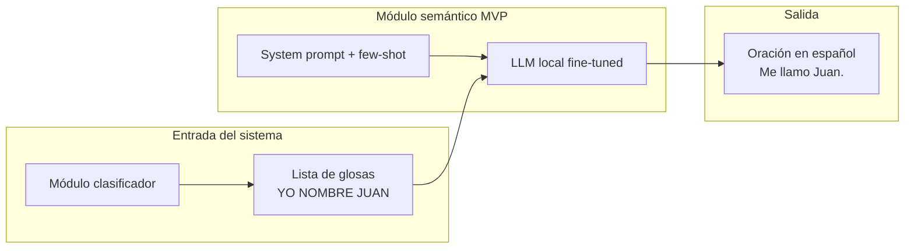

# Proyecto LSA 2026 — Ficha Técnica de Entrega (MVP)

**Módulo:** Semántico  
**Iteración:** MVP  
**Fecha estimada de entrega:** 24/07/2026  
**Rama de trabajo:** [`modulo-semantico`](https://github.com/FranciscoVeronING/2026_Proyecto_LSA/tree/modulo-semantico)

---

## 1. Alcance y objetivos de la entrega

El módulo semántico actúa como un **intérprete textual** dentro de esta etapa del sistema. Su trabajo principal es recibir una **lista ordenada de glosas** enviada por el módulo clasificador y transformarla en una **oración fluida, clara y gramaticalmente correcta en español rioplatense**.

A partir de una secuencia de señas individuales (representadas como etiquetas en MAYÚSCULAS), el módulo analiza el contexto lingüístico y genera como salida un texto natural que cualquier persona puede leer y entender.

### Objetivos concretos del MVP

| Objetivo | Estado |
|----------|--------|
| Definir arquitectura y criterios de selección de LLM local | Completado |
| Diseñar prompt de sistema + few-shot para gloss→español | Completado |
| Construir dataset sintético de entrenamiento/evaluación | Completado (~202 pares; **no validado por experta LSA**) |
| Fine-tuning LoRA con Unsloth sobre modelos candidatos | Completado |
| Evaluación cuantitativa (BLEU, ROUGE-L, METEOR) | Completado |
| Herramienta interactiva de prueba manual | Completado (`interactive_chat.py`) |
| Integración en tiempo real con `camera.py` / extensión web | Pendiente (siguiente iteración) |

---

## 2. Arquitectura de implementación

### 2.1 Visión general del pipeline

El MVP implementa un flujo **offline de entrenamiento y evaluación**, preparado para integrarse luego en un agente local con Ollama.



En la iteración MVP, el foco estuvo en la **capa de traducción semántica** (prompt + fine-tuning + evaluación). La conexión en vivo con la cámara y la extensión de navegador quedó planificada para la siguiente fase (ver `docs/plan_modulo_semantico.md`).

### 2.2 Stack tecnológico implementado

| Capa | Tecnología | Rol en el MVP |
|------|------------|---------------|
| Inferencia local (objetivo producción) | **Ollama** | Ejecutar modelos GGUF/Q4 en PC del usuario |
| Fine-tuning | **Unsloth** + **TRL** + **PEFT/LoRA** | Entrenamiento eficiente en GPU NVIDIA |
| Modelos base | Hugging Face (`unsloth/*`) | Variantes 0.5B–1.7B en 4-bit |
| Framework ML | **PyTorch** (CUDA 12.6) | Entrenamiento en GPU |
| Evaluación | **Hugging Face Evaluate** | BLEU, ROUGE-L |
| Dataset | JSON propio | Pares `{glosses, spanish}` |
| Entorno | **Anaconda** (`lsa-train`, Python 3.11) | Aislamiento de dependencias |

### 2.3 Estructura del código en el repositorio

```
src/semantic/
├── prompts/
│   ├── sys_prompt.txt          # Prompt de sistema (rol, reglas, restricciones)
│   └── few_shot_examples.json  # 7 ejemplos inyectados al system prompt
├── dataset_glosas.json         # Dataset principal (~202 pares)
├── _generate_dataset.py        # Generador sintético (vocabulario 100 glosas)
├── reorder_glosses_lsa.py      # Reordenamiento gramatical LSA
├── train_llm.py                # Entrenamiento de UN modelo (configurable)
├── train_runner.py             # Lógica reutilizable de entrenamiento + evaluación
├── train_all_models.py         # Batch secuencial de 5 modelos
├── requirements_train.txt      # Dependencias pip (sin unsloth, ver doc)
└── outputs/                    # Adaptadores LoRA, métricas, gráficos (gitignored)

docs/
├── entrenamiento_llm.md        # Guía de setup y ejecución
├── comparativa_llm_modulo_semantico.md
├── plan_modulo_semantico.md
└── entregables_mvp_modulo_semantico.md   # Este documento
```

---

## 3. Implementación del prompt de sistema

### 3.1 Diseño del prompt

Se implementó un **system prompt estructurado** en `src/semantic/prompts/sys_prompt.txt`, organizado en secciones:

1. **Rol:** intérprete LSA → español rioplatense.
2. **Qué es una glosa:** unidades léxicas en MAYÚSCULAS, orden LSA ≠ orden español.
3. **Dominio:** comunicación en contextos de seguridad/asistencia (100 señas).
4. **Reglas de traducción:** interrogativas, negación, pronombres, deletreo, orden gramatical LSA.
5. **Restricciones:** no inventar datos, no explicar razonamiento, no markdown.
6. **Limitaciones:** sin acceso a marcadores no manuales (cejas, expresión facial).
7. **Formato de salida:** una sola oración, sin prefijos ni comillas.

### 3.2 Few-shot embebido en el system prompt

En `train_runner.py` y `train_llm.py`, la función `load_system_prompt()` concatena automáticamente los ejemplos de `few_shot_examples.json` al final del system prompt:

```
Ejemplos de traducción:
Glosas: HOLA -> Español: Hola.
Glosas: YO NOMBRE J U A N -> Español: Me llamo Juan.
...
```

Esto permite que el modelo reciba **contexto in-context** sin modificar la arquitectura del LLM.

### 3.3 Formato de conversación para entrenamiento

Cada ejemplo del dataset se convierte a un diálogo de tres turnos usando el **chat template** del modelo:

| Rol | Contenido |
|-----|-----------|
| `system` | Prompt completo + few-shot |
| `user` | `Glosas: YO NOMBRE JUAN` |
| `assistant` | `Me llamo Juan.` |

La tokenización resultante ocupa ~**1040 tokens** por ejemplo, por lo que se configuró `max_seq_length = 2048` para evitar truncamiento.

---

## 4. Implementación del dataset

### 4.1 Formato de datos

```json
{
  "glosses": ["AHORA_HOY", "YO", "BIEN"],
  "spanish": "Hoy estoy bien."
}
```

- **`glosses`:** secuencia ordenada de etiquetas LSA (MAYÚSCULAS).
- **`spanish`:** traducción de referencia en español argentino.

### 4.2 Generación sintética

Se implementó `_generate_dataset.py` para producir pares glosa→español con:

- Vocabulario acotado de **100 glosas** (`ALLOWED_GLOSSES`).
- Distribución objetivo: 60% declarativas, 25% preguntas, 15% cortas.
- Plantillas curadas y filtros de calidad (evitar oraciones incoherentes).
- Soporte de deletreo (nombres, apellidos, números de documento).

El dataset activo `dataset_glosas.json` contiene **202 pares**. Está marcado como **NO VALIDADO** por una experta LSA; es material de desarrollo, no corpus gold definitivo.

### 4.3 Reordenamiento gramatical LSA

Se implementó `reorder_glosses_lsa.py` para normalizar el orden de glosas según la gramática LSA acordada:

**TIEMPO → LUGAR → SUJETO/OBJETO → VERBO → NEGACIÓN/AFIRMACIÓN → PREGUNTA**

Ejemplo:

| Antes | Después |
|-------|---------|
| `YO AYER PLAZA IR` | `AYER PLAZA YO IR` |

En la corrida sobre `dataset_glosas1.json`, **27 de 202** entradas fueron reordenadas.

---

## 5. Implementación del entrenamiento (Fine-Tuning LoRA)

### 5.1 Técnica utilizada

Se aplicó **Transfer Learning** con:

| Parámetro | Valor implementado |
|-----------|-------------------|
| Método | LoRA (Low-Rank Adaptation) |
| Rank (`r`) | 16 |
| Alpha | 16 |
| Dropout | 0 |
| Cuantización | 4-bit (QLoRA) |
| Target modules | `q_proj`, `k_proj`, `v_proj`, `o_proj`, `gate_proj`, `up_proj`, `down_proj` |
| Fallback | `all-linear` (Phi-3, SmolLM2) |
| Optimizador | `adamw_8bit` |
| Learning rate | 2e-4 |
| Batch efectivo | 2 × 4 acumulación = 8 |
| Max steps | 60 (por modelo) |
| Split train/test | 80/20, seed=3407 |

### 5.2 Scripts de entrenamiento

| Script | Función |
|--------|---------|
| `train_llm.py` | Entrena **un solo modelo**. Se edita `MODEL_NAME` al inicio del archivo. |
| `train_runner.py` | Núcleo reutilizable: carga modelo, aplica LoRA, entrena, evalúa, guarda artefactos. |
| `train_all_models.py` | Entrena **5 modelos en secuencia**, con logs y resumen acumulado. |

**Modelos entrenados en batch:**

| ID | Modelo Hugging Face |
|----|---------------------|
| `qwen2.5-0.5b` | `unsloth/Qwen2.5-0.5B-Instruct` |
| `qwen2.5-1.5b` | `unsloth/Qwen2.5-1.5B-Instruct` |
| `llama-3.2-1b` | `unsloth/Llama-3.2-1B-Instruct` |
| `phi-3-mini-4k` | `unsloth/Phi-3-mini-4k-instruct` |
| `smollm2-1.7b` | `unsloth/SmolLM2-1.7B-Instruct` |

Adicionalmente se evaluó **Qwen 2.5 3B** y **DeepSeek-R1-Distill-Qwen-1.5B** en inferencia con Ollama (sin necesariamente pasar por el mismo pipeline batch).

### 5.3 Salidas generadas por cada corrida

```
outputs/unsloth_Qwen2.5-0.5B-Instruct/
├── lora_adapter/           # Pesos LoRA + tokenizer
├── checkpoints/            # Checkpoints intermedios
├── metrics.json            # BLEU, ROUGE-L, accuracy, ejemplos
├── training_history.json   # Loss por step
└── loss_plot.png           # Gráfico de curva de loss
```

También se generan:

- `outputs/training_summary.json` — historial acumulado de todas las corridas.
- `logs/train_all_YYYYMMDD_HHMMSS.log` — log textual del batch.

### 5.4 Entorno de ejecución

Documentado en `docs/entrenamiento_llm.md`. Resumen:

```powershell
conda create -n lsa-train python=3.11 -y
conda activate lsa-train
cd src\semantic
pip install torch torchvision --index-url https://download.pytorch.org/whl/cu126
pip install -r requirements_train.txt
pip install unsloth unsloth_zoo --no-deps

python train_all_models.py --continue-on-error
```

> **Nota técnica:** Unsloth debe instalarse con `--no-deps` para evitar que pip reemplace PyTorch CUDA por la versión CPU en Windows.

---

## 6. Implementación de la evaluación

### 6.1 Protocolo de evaluación

Tras cada entrenamiento, `train_runner.py` ejecuta evaluación automática sobre el **20% de test**:

1. Pone el modelo en modo inferencia (`FastLanguageModel.for_inference`).
2. Para cada ejemplo de test, construye el prompt (system + user con glosas).
3. Genera respuesta con `temperature=0.1`, `max_new_tokens=64`.
4. Calcula métricas contra la referencia.

### 6.2 Métricas implementadas

| Métrica | Qué mide | Implementación |
|---------|----------|----------------|
| **BLEU** | Precisión léxica (n-gramas coincidentes) | `evaluate.load("bleu")` |
| **ROUGE-L** | Solapamiento de secuencia más larga (fluidez) | `evaluate.load("rouge")` |
| **METEOR** | Sinónimos y variaciones morfológicas | Evaluación complementaria en comparativa Ollama |
| **Accuracy exacta** | % de frases idénticas al gold | Implementada en `train_runner.py` |

METEOR contempla sinónimos y raíces léxicas, complementando las limitaciones de BLEU y ROUGE-L en traducciones con múltiples formulaciones válidas.

---

## 7. Implementación de la herramienta interactiva

Se desarrolló **`interactive_chat.py`**, una consola interactiva para probar modelos fine-tuned sin integrar aún la cámara:

```
[Glosas] > NOMBRE APELLIDO QUE
[Español] > ¿Quién soy?
```

Permite ingresar secuencias de glosas separadas por espacios y observar la traducción del modelo en tiempo real. Fue la herramienta principal para validación cualitativa de los resultados presentados en la sección 9.

---

## 8. Justificación de elección de modelos

Para la selección se tuvieron en cuenta tres criterios principales:

1. **Tamaño compacto (0.5B–3B):** viable en GPUs consumer y en CPU vía Ollama.
2. **Arquitectura moderna:** Qwen 2.5 y Llama 3.2 destacan en instruction following y traducción con pocos datos.
3. **Eficiencia local:** SmolLM2 y Phi-3-mini como alternativas de bajo consumo.

| Familia | Fortaleza | Uso en el proyecto |
|---------|-----------|-------------------|
| Qwen 2.5 | Mejor español y seguimiento de instrucciones | Modelo preliminar seleccionado (3B) |
| Llama 3.2 | Eficiencia Meta, buen baseline | Comparativa |
| Phi-3-mini | MIT, razonamiento compacto | Comparativa |
| SmolLM2 | Mínimo consumo | Tier hardware bajo |
| DeepSeek-R1-Distill | Razonamiento chain-of-thought | Descartado (0 BLEU en gloss→ES) |

---

## 9. Métricas de rendimiento y validación

### 9.1 Resultados cuantitativos (evaluación Ollama + fine-tuning)

| Modelo | BLEU | METEOR | ROUGE-L |
|--------|------|--------|---------|
| Qwen 2.5 0.5B | 9.98 | 37.08 | 38.99 |
| Qwen 2.5 1.5B | 19.79 | 49.24 | 52.09 |
| **Qwen 2.5 3B** | **48.04** | **70.87** | **73.66** |
| Llama 3.2 | 19.62 | 45.46 | 47.71 |
| SmolLM2 | 12.46 | 36.52 | 35.63 |
| Phi-3-mini-4k | 29.21 | 54.13 | 57.96 |
| DeepSeek-R1-Distill-Qwen-1.5B | 0.0 | 14.34 | 6.64 |

### 9.2 Selección preliminar del modelo

Se seleccionó de forma preliminar **Qwen 2.5 3B**, por desempeño superior en las pruebas cuantitativas. Para implementaciones en navegador con hardware limitado, **Qwen 2.5 1.5B** podría ser más ventajosa por ligereza, aunque queda temporalmente descartada por la divergencia observada en interpretación semántica (ver ejemplos cualitativos).

### 9.3 Validación cualitativa — Qwen 2.5 3B (correcto)

| Glosas | Traducción |
|--------|------------|
| `NOMBRE APELLIDO QUE` | ¿Quién soy? |
| `NOMBRE APELLIDO VOS QUE` | Me llaman [Nombre Apellido]. ¿Quien tú? |
| `DOCUMENTO NUMERO REPETIR` | Repito mi número de documento. |
| `VOS AÑOS CUANTOS` | ¿Cuántos años tienes? |
| `AHORA_HOY DIA QUE` | ¿Qué día hoy? |
| `AYER VIERNES LUGAR PLAZA` | Viernes pasado estaba en la plaza. |
| `EL_ELLA LUNES LLAMAR` | El lunes llama él. |

### 9.4 Validación cualitativa — Qwen 2.5 1.5B (errores)

| Glosas | Traducción (incorrecta) |
|--------|-------------------------|
| `NOMBRE APELLIDO QUE` | ¿Cómo se llama usted? |
| `NOMBRE APELLIDO VOS QUE` | Me llamo… Vos. Que nombre tienes? |
| `DOCUMENTO NUMERO REPETIR` | ¿Qué quieres hacer con tu número de documento? |
| `AYER VIERNES LUGAR PLAZA` | El lugar fue el parqueadero. |

La diferencia entre 3B y 1.5B confirma que el tamaño del modelo impacta directamente en la **comprensión del dominio LSA** y no solo en fluidez superficial.

---

## 10. Limitaciones del MVP y trabajo futuro

| Limitación | Impacto | Próximo paso |
|------------|---------|--------------|
| Dataset no validado por experta LSA | Riesgo de traducciones gold incorrectas | Revisión con Miriam Rolls |
| Dataset pequeño (~202 pares) | Overfitting, métricas inestables | Expandir a 500+ pares curados |
| Sin integración en `camera.py` | No hay traducción en tiempo real | Sprint 5 del plan semántico |
| Sin buffer de oración / pausa larga | Glosas sueltas, no mensajes completos | `UtteranceSegmenter` + `ConversationMemory` |
| Marcadores no manuales no capturados | Preguntas/negación inferidas solo por glosas | Documentado como limitación del clasificador |
| DeepSeek-R1 no apto | Chain-of-thought no ayuda en gloss→ES directo | Descartado para este módulo |

---

## 11. Resumen de tecnologías y componentes

| Componente | Tecnología |
|------------|------------|
| Motor de inferencia (producción) | Ollama |
| Fine-tuning | Unsloth + TRL + PEFT (LoRA 4-bit) |
| Modelos evaluados | Qwen 2.5 (0.5B, 1.5B, 3B), Llama 3.2 (1B), SmolLM2 (1.7B), Phi-3-mini-4k, DeepSeek-R1-Distill |
| Métricas | BLEU, ROUGE-L, METEOR, accuracy exacta |
| Dataset | ~202 pares glosa→español (**NO VALIDADO**) |
| Prompt | `sys_prompt.txt` + `few_shot_examples.json` |
| Scripts clave | `train_runner.py`, `train_all_models.py`, `interactive_chat.py` |
| Documentación | `docs/entrenamiento_llm.md` |

---

## 12. Cómo reproducir los resultados

1. Clonar la rama `modulo-semantico` del repositorio.
2. Crear entorno Conda siguiendo `docs/entrenamiento_llm.md`.
3. Entrenar modelos: `python train_all_models.py --continue-on-error`.
4. Probar interactivamente: `python interactive_chat.py` (modelo configurable).
5. Revisar métricas en `src/semantic/outputs/*/metrics.json`.

Repositorio: [https://github.com/FranciscoVeronING/2026_Proyecto_LSA/tree/modulo-semantico](https://github.com/FranciscoVeronING/2026_Proyecto_LSA/tree/modulo-semantico)

---

## 13. Bitácora de trabajo

| Día | Responsable | Horario |
|-----|-------------|---------|
| Lunes | Fran | 21:00 – 22:30 |
| Martes | Ambos | 17:30 – 21:00 |
| Miércoles | Fran | 19:00 – 22:00 |
| Jueves | Maite | 17:00 – 18:30 |
| Jueves | Fran | 10:00 – 12:00, 20:00 – 21:00 |
| Viernes | Maite | 17:30 – … |
| Viernes | Fran | 18:00 – 20:00 |

---

*Documento ampliado a partir de «Entregables MVP.pdf», incorporando detalle de implementación del código en la rama `modulo-semantico`.*
