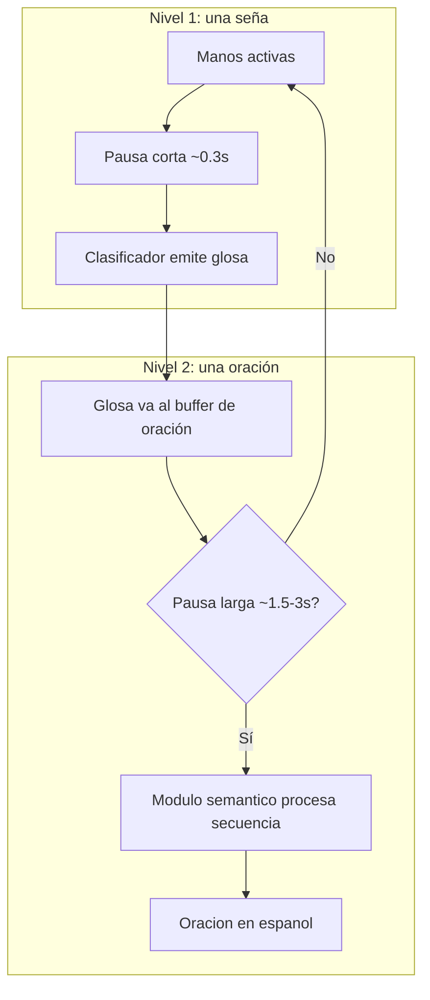
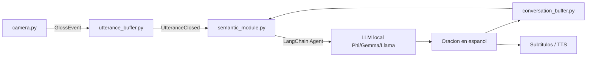

# Plan: Módulo semántico LSA → Español

Documento de diseño para el módulo semántico del proyecto **2026_Proyecto_LSA**.  
Rama: `modulo-semantico` · Última actualización: julio 2026.

---

## 1. Lo que tenés que entender primero (sin jerga innecesaria)

### Glosa ≠ palabra en español

Cuando el clasificador predice `"nombre"`, `"yo"` o `"A"`, eso **no es una oración**: es una **glosa** — una etiqueta escrita que representa una seña. En lingüística de lenguas de señas se escriben en MAYÚSCULAS (ej: `YO NOMBRE MARÍA`).

El módulo semántico no debe "traducir palabra por palabra". Debe **reordenar, completar y contextualizar** para producir español hablado/escrito natural.

**Ejemplo concreto con tu vocabulario:**

| Lo que hace el sordo (glosas detectadas) | Español probable |
| ---------------------------------------- | ---------------- |
| `YO NOMBRE JUAN` | "Me llamo Juan" / "Mi nombre es Juan" |
| `DONDE CASA` | "¿Dónde está tu casa?" / "¿Dónde queda la casa?" |
| `DOCUMENTO NUMERO` | "Mi número de documento es..." (falta el valor) |
| `AYER MAL` | "Ayer me sentí mal" / "Ayer estuve mal" |

El LLM infiere artículos, conjugaciones y preguntas que **no existen como señas separadas** en tu dataset.

### Por qué la gramática de la LSA es distinta al español

La LSA es una **lengua natural propia** (Ley 27.710), no "español con las manos". Para el módulo semántico, lo más importante:

1. **Estructura tópico-comentario**: primero se marca *de qué se habla*, después el comentario.
   - Seña: `MI NOMBRE` + nombre propio → Español: "Mi nombre es..."

2. **Sin artículos**: no hay equivalente sistemático de *el/la/un/una*. El LLM debe agregarlos en español.

3. **Tiempo y modo en el espacio**: ayer/hoy/mañana suelen ir al inicio; las preguntas se marcan con expresión facial (cejas levantadas) — **el clasificador actual NO captura marcadores no manuales** (rostro, cuerpo). Esto es una limitación real: el módulo semántico tendrá que inferir preguntas por contexto o palabras como `DONDE`, `QUIEN`, `COMO`.

4. **Pronombres espaciales**: `YO`, `VOS`, `EL_ELLA` pueden referirse a posiciones en el espacio de señado. Sin cámara contextual, el buffer conversacional ayuda a resolver "¿a quién se refiere?".

5. **Dedos alfabeto vs señas léxicas**: `A B C...` pueden ser deletreo (nombre, apellido, calle). El módulo debe detectar **rachas de letras** y tratarlas como una sola unidad (`A P E L L I D O` → "Apellido" o deletreo de un apellido).

6. **Una seña ≠ una palabra siempre**: `VIVIR_EN` puede traducirse como "vivo en"; `AHORA_HOY` como "hoy".

### Dos tipos de pausa (clave para el buffer)

La intuición es correcta, pero hay **dos escalas de pausa**:



- **Pausa corta** (`STILL_FRAMES_LIMIT = 10` en `src/config.py`): ya la usa `src/camera.py` para detectar **fin de una seña**.
- **Pausa larga** (nuevo parámetro, ej. `UTTERANCE_PAUSE_SEC = 2.0`): indica **fin de un mensaje/oración** y dispara el módulo semántico.

Esto coincide con lo acordado con la experta Miriam Rolls en `docs/Informe.tex` (línea ~250).

---

## 2. Estado actual del proyecto

Hoy `src/camera.py`:

- Detecta gestos y emite **una glosa suelta** (`shared_state["prediction"]`) con confianza.
- No acumula glosas en un buffer de oración.
- No distingue pausa entre señas vs pausa entre mensajes.
- No existe `semantic.py` ni integración LangChain en el repo.

El informe ya define la arquitectura objetivo (`docs/Informe.tex` líneas 104-108, 205-207):

- Agente LangChain + LLM local (Gemma, Llama, Phi).
- Buffer circular de últimos ~10 mensajes (RF-07).
- Entrada: secuencia de glosas + historial conversacional.

---

## 3. Contrato de integración: clasificador → módulo semántico

Definir un formato **estable y desacoplado** para que ambos módulos evolucionen por separado.

### 3.1 Evento que emite el clasificador (por cada seña reconocida)

```python
{
    "type": "gloss",
    "gloss": "nombre",           # clave del mapeo_clases.json
    "gloss_display": "NOMBRE",   # normalizado para el LLM
    "confidence": 0.91,
    "timestamp": 1720000000.12,
    "speaker": "deaf_user"
}
```

### 3.2 Normalización de nombres de glosas

`src/model/mapeo_clases.json` tiene inconsistencias que el LLM no debe ver crudas:

| Clave actual | Glosa normalizada sugerida |
| ------------ | -------------------------- |
| `el_ella` | `EL/ELLA` |
| `esposo a` | `ESPOSO/A` |
| `ahora_hoy` | `HOY` |
| `vivir_en` | `VIVIR-EN` |
| `hermano_a` | `HERMANO/A` |

Crear un mapeo `gloss_normalizer.py` o diccionario en config.

### 3.3 Reglas de filtrado antes de entrar al buffer

| Situación | Acción |
| --------- | ------ |
| Confianza < umbral (ej. 0.85) | Descartar o marcar como `[INCERTO]` |
| Misma glosa repetida en < 1s | Ignorar duplicado (rebote del clasificador) |
| Rachas de letras A-Z/0-9 | Agrupar en token `DELETREO:...` antes del LLM |
| Glosa fuera del vocabulario | `[DESCONOCIDA]` + log para debugging |

### 3.4 Buffer de oración (utterance buffer)

Estructura mientras el sordo sigue señando:

```python
{
    "glosses": ["YO", "NOMBRE", "JUAN"],
    "started_at": ...,
    "last_gloss_at": ...,
    "speaker": "deaf_user"
}
```

Cuando `now - last_gloss_at > UTTERANCE_PAUSE_SEC` → **cerrar utterance** y enviar al módulo semántico.

### 3.5 Buffer conversacional (context buffer, RF-07)

Circular de últimos N=10 mensajes **ya traducidos**:

```python
{
    "role": "deaf_user" | "hearing_user",
    "glosses": ["YO", "DOCUMENTO"],      # solo si es sordo
    "text": "Mi número de documento es...",  # salida final
    "timestamp": ...
}
```

Esto permite diálogos como:

- Oyente: "¿Cuál es tu documento?"
- Sordo: `DOCUMENTO NUMERO` → "Mi número de documento es 45.678.901" (el número puede venir deletreado después).

---

## 4. Arquitectura propuesta del módulo semántico



### Archivos nuevos sugeridos

| Archivo | Responsabilidad |
| ------- | --------------- |
| `src/gloss_events.py` | Dataclasses: `GlossEvent`, `Utterance`, `ConversationMessage` |
| `src/gloss_normalizer.py` | Mapeo clave → glosa legible + detección de deletreo |
| `src/utterance_buffer.py` | Acumula glosas; detecta pausa larga; emite utterance cerrado |
| `src/conversation_buffer.py` | Cola circular de últimos 10 mensajes |
| `src/semantic_module.py` | Orquesta prompt + LLM + post-procesado |
| `src/semantic_prompts.py` | System prompt, ejemplos few-shot, reglas de dominio |
| `src/config.py` | Nuevos parámetros: `UTTERANCE_PAUSE_SEC`, `CONTEXT_BUFFER_SIZE`, modelo LLM |

### Cambios en `src/camera.py`

- En `InferenceWorker`, en lugar de solo actualizar `shared_state["prediction"]`, publicar un `GlossEvent` al `UtteranceBuffer`.
- Mostrar en UI: glosas acumuladas + oración traducida cuando esté lista.
- Mantener la predicción individual visible (feedback inmediato al sordo).

---

## 5. Diseño del agente LLM (LangChain)

### System prompt (contenido esencial)

El prompt debe instruir al modelo para:

1. Recibir glosas en orden LSA (no reordenar arbitrariamente sin criterio lingüístico).
2. Producir **español rioplatense/argentino** natural.
3. Agregar artículos, preposiciones y conjugaciones faltantes.
4. Usar el **contexto conversacional** para resolver pronombres y preguntas implícitas.
5. Dominio: seguridad y viajero (policía, datos personales, ubicación, emergencia).
6. **No inventar datos** que no estén en las glosas (ej. no poner un número de documento si no fue deletreado).
7. Si hay ambigüedad, preferir la interpretación más probable del contexto; si es muy ambiguo, devolver 2 opciones o marcar incertidumbre.

### Few-shot examples (críticos)

Incluir 15-20 pares validados por la experta en LSA, por ejemplo:

```
Glosas: YO NOMBRE MARÍA
Español: Me llamo María.

Glosas: DONDE CASA
Español: ¿Dónde queda la casa?

Glosas: DOCUMENTO NUMERO
Español: (Necesito el número) ¿Cuál es tu número de documento?
```

Los ejemplos son **más importantes que el tamaño del modelo** para un vocabulario acotado de ~100 señas.

### Modelo local recomendado (RNF-02)

| Modelo | Ventaja | Consideración |
| ------ | ------- | ------------- |
| **Phi-3 mini (3.8B)** | Corre en GPU consumer, buen español | Primera opción para prototipo |
| **Gemma 2 2B/9B** | Open source, eficiente | 9B necesita más VRAM |
| **Llama 3.2 3B** | Buen razonamiento | Verificar licencia y español |

Coordinar con Maite si ya hay prototipo LangChain en otra rama/repo para no duplicar.

### Post-procesado

- Quitar comillas, markdown, explicaciones del LLM.
- Validar que la salida no contenga glosas en MAYÚSCULAS sin traducir.
- Opcional: reglas hardcoded para patrones frecuentes del dominio (nombre/apellido/documento) como fallback si el LLM falla.

---

## 6. Casos especiales de tu vocabulario

Prever lógica (en normalizer o prompt) para:

- **Datos personales**: secuencias `NOMBRE`, `APELLIDO`, `DOCUMENTO`, `CALLE`, `NUMERO` en contexto policial (CU-02 del informe).
- **Preguntas WH**: `DONDE`, `QUIEN`, `COMO`, `CUANDO`, `QUE`, `CUANTOS` → forzar interrogativa en español.
- **Negación**: `NO` + verbo → "no puedo", "no quiero"; sin marcador facial, confiar en la glosa `NO`.
- **Días de la semana**: traducción directa, poco contexto necesario.
- **Deletreo**: si llegan 3+ letras consecutivas del alfabeto, unir antes del LLM.

---

## 7. Evaluación (cómo saber si funciona)

### Dataset de prueba semántico (crear con experta LSA)

Tabla CSV/JSON con columnas:

- `glosses`: lista de glosas
- `spanish_expected`: traducción acordada
- `context`: mensajes previos (opcional)
- `scenario`: policial / viajero / saludo

Métricas:

- **Exact match** (estricto, poco realista)
- **BLEU / chrF** (estándar en traducción de señas)
- **Evaluación humana** con Miriam Rolls (esencial para el TFG)

### Pruebas de integración end-to-end

1. Simular secuencia de glosas con timestamps (sin cámara).
2. Verificar que pausa larga dispara traducción.
3. Verificar que contexto mejora casos ambiguos (ej. `DOCUMENTO` tras pregunta del oyente).

---

## 8. Limitaciones que debés documentar en el TFG

1. **Sin marcadores no manuales**: preguntas, negación intensa, tamaño de seña (rostro) no se capturan.
2. **Vocabulario cerrado**: fuera de las ~100 señas, no hay traducción.
3. **Latencia**: clasificador + pausa larga + LLM local puede acercarse o superar los 2s del RNF-01; medir y ajustar `UTTERANCE_PAUSE_SEC`.
4. **Alucinaciones del LLM**: mitigar con prompt estricto + few-shot + "no inventar datos".
5. **Deletreo**: el clasificador predice letras sueltas; agrupar bien es crítico para nombres propios.

---

## 9. Orden de implementación recomendado

### Fase A — Contrato y buffers (sin LLM)

- [ ] Definir `GlossEvent` y normalizer.
- [ ] Implementar `UtteranceBuffer` con pausa larga configurable.
- [ ] Implementar `ConversationBuffer`.
- [ ] Integrar en `camera.py` mostrando glosas acumuladas en pantalla.

### Fase B — Módulo semántico offline

- [ ] Crear `semantic_prompts.py` con ejemplos validados por experta.
- [ ] Implementar `semantic_module.py` con LangChain + LLM local.
- [ ] Script `test_semantic.py` que lee pares glosa→español desde JSON.

### Fase C — Integración en tiempo real

- [ ] Conectar utterance cerrado → semantic module → UI/subtítulos.
- [ ] Agregar contexto del oyente (cuando exista el módulo de audio).
- [ ] Medir latencia end-to-end.

### Fase D — Validación

- [ ] Armar corpus de prueba con experta.
- [ ] Iterar prompts y few-shot según errores.
- [ ] Documentar en informe y `docs/documentacion.md`.

---

## 10. Bibliografía recomendada (con explicación)

### Lengua de señas y LSA (fundamentos)

1. **Ley 27.710 (2020)** — [Boletín Oficial](https://www.argentina.gob.ar/normativa/nacional/ley-27044-347539)
   - *Qué aporta:* Marco legal que reconoce la LSA como lengua propia. Justifica por qué el sistema no puede ser "español escrito con gestos".

2. **INJU — Diccionario de Señas** — [senas.inju.gob.ar](https://senas.inju.gob.ar/)
   - *Qué aporta:* Referencia oficial de formas de señas argentinas. Útil para validar que las glosas corresponden a señas reales y para armar ejemplos few-shot.

3. **Sutton-Spence & Woll, *The Linguistics of British Sign Language* (1999)**
   - *Qué aporta:* Introducción clara a conceptos universales de lenguas de señas: glosas, marcadores no manuales, estructura tópico-comentario, clasificadores. Aunque es BSL (británica), la gramática es comparable a la de la LSA para fines de diseño del módulo semántico.

4. **Pinedo, F. et al. — trabajos sobre LSA y tecnología en SciELO Argentina**
   - *Qué aporta:* Contexto local académico sobre LSA en Argentina. Buscar en [SciELO](https://www.scielo.org.ar/) "lengua de señas argentina reconocimiento".

### Traducción automática de señas (lo que hace el módulo semántico)

5. **Camgöz, S. C. et al. (2018). *Neural Sign Language Translation*. CVPR** — [paper](https://openaccess.thecvf.com/content_cvpr_2018/html/Camgoz_Neural_Sign_Language_CVPR_2018_paper.html)
   - *Qué aporta:* Define el pipeline estándar **Video → Gloss → Text**. El proyecto sigue exactamente esta arquitectura; el módulo semántico es el paso Gloss→Text.

6. **Camgöz, S. C. et al. (2020). *Sign Language Transformers*. ECCV**
   - *Qué aporta:* Modelos Transformer para traducir secuencias de glosas a texto. Aunque se usa un LLM en vez de un Transformer entrenado, el paper explica por qué el orden de glosas importa y por qué no alcanza traducción palabra a palabra.

7. **Müller, M. et al. (2022). *Findings of the First WOSLT Workshop* (Gloss-free / Gloss-based SLT)**
   - *Qué aporta:* Estado del arte en traducción de lengua de señas. Comparar enfoques con glosas (como el de este proyecto) vs sin glosas.

### LLMs para el paso Gloss → Text

8. **LangChain Documentation — Memory / ConversationBuffer** — [docs.langchain.com](https://python.langchain.com/docs/concepts/memory/)
   - *Qué aporta:* Cómo implementar el buffer circular de contexto definido en RF-07.

9. **OpenASL / WLASL papers sobre weak supervision en glosas**
   - *Qué aporta:* Muestran que las glosas automáticas (como las del clasificador) tienen ruido; el módulo semántico debe ser tolerante a errores y ambigüedad.

### Evaluación

10. **Papineni et al. (2002). BLEU** — métrica estándar de traducción automática.
    - *Qué aporta:* Métrica cuantitativa para comparar la salida en español vs referencia. Complementar siempre con evaluación de la experta en LSA.

11. **Géron, A. *Hands-On Machine Learning* — capítulos de NLP**
    - *Qué aporta:* Introducción accesible a prompts, evaluación y límites de LLMs si no hay background en PLN.

---

## 11. Resumen: qué tener en cuenta para unir clasificador y módulo semántico

| Tema | Decisión |
| ---- | -------- |
| Unidad de salida del clasificador | `GlossEvent` con glosa + confianza + timestamp |
| Cuándo traducir | Pausa **larga** entre señas, no cada glosa aislada |
| Formato al LLM | Glosas normalizadas en MAYÚSCULAS, separadas por espacio |
| Contexto | Buffer de últimos 10 mensajes (sordo + oyente) |
| Deletreo | Agrupar letras consecutivas antes del LLM |
| Baja confianza | Filtrar o marcar; no enviar ruido al semántico |
| Dominio | Prompt con escenarios policial/viajero + few-shot validados |
| Privacidad | LLM local (Phi/Gemma/Llama), sin enviar video |
| Validación | Corpus glosa→español con experta LSA, no solo métricas automáticas |
